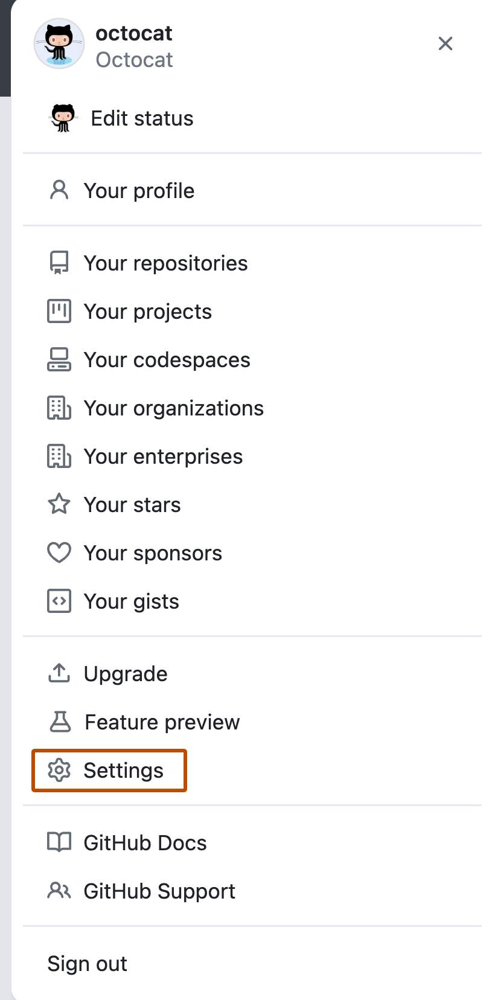
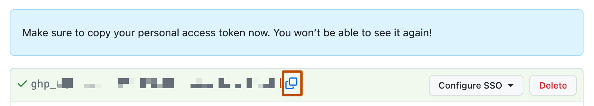

# 02 — GitHub Account, Git Installation & Personal Access Token

| | |
|---|---|
| ⏱️ **Time** | 15 minutes |
| 🎯 **Outcome** | GitHub account ✔ · Git installed on your laptop ✔ · a **Personal Access Token (PAT)** saved in `workshop-secrets.txt` ✔ |

---

## 📚 Concept

| Term | What it is | Analogy |
|---|---|---|
| **Git** | A program on your computer that records every change to your files (version control) | A "save game" history for your code |
| **GitHub** | A website that stores Git repositories online so teams can share them | Google Drive, but for Git repositories |
| **Repository (repo)** | A project folder tracked by Git | |
| **Personal Access Token (PAT)** | A long random password that lets the `git` command (and tools like Jenkins) prove who you are | A hotel key-card: works only for the doors and days you choose, and can be cancelled anytime |

### Why a token and not my password?

GitHub **does not accept your account password** for `git push` from the command line. You must use a token.
Tokens are safer because:

- they can be limited to specific permissions (**scopes**),
- they **expire** automatically,
- you can **revoke** one token without changing your password.

> 🛡️ A token is a **secret**. Anyone who has it can push code as you. Never paste it into a chat group, a
> screenshot, or a file inside a Git repository.

---

## 🛠️ Steps

### Step 1 — Create a GitHub account 🌐 Browser

1. Go to **https://github.com** → **Sign up**.
2. Enter email, password and a **username**.
   💡 Choose a professional username (e.g. `ravi-kumar-dev`) — recruiters will see it on your profile later.
3. Verify your email with the code GitHub sends.
4. If GitHub asks you to enable **two-factor authentication (2FA)**, do it with an authenticator app.

✅ **Check:** you can open `https://github.com/<YOUR_GITHUB_USERNAME>` and see your profile page.

Write your username in `workshop-secrets.txt`.

---

### Step 2 — Install Git on your laptop 💻 Laptop

<details open>
<summary><b>🪟 Windows</b></summary>

1. Download from **https://git-scm.com/downloads/win** → *"Click here to download"* (64-bit installer).
2. Run the installer. **Keep the defaults** on every screen, except this one:
   - **"Adjusting the name of the initial branch in new repositories"** → select
     **Override the default branch name for new repositories** and type `main`.
3. Finish the installer.
4. Open the Start menu → search **Git Bash** → open it. A black terminal window appears.

✅ **Check** (type in Git Bash):

```bash
git --version
```

Expected output (version number may be higher):

```text
git version 2.5x.x.windows.1
```

> 💡 **Git Bash** is the terminal we will use on Windows for the whole workshop. It understands the same
> commands as the Linux server, so copy-paste works the same way.
</details>

<details>
<summary><b>🍎 macOS</b></summary>

1. Open **Terminal** (Cmd + Space → type *Terminal*).
2. Run:

```bash
git --version
```

3. If Git is not installed, macOS shows a pop-up offering to install the **Command Line Developer Tools** —
   click **Install** and wait (5–10 minutes). Then run `git --version` again.

✅ **Check:** output shows `git version 2.x.x`.
</details>

<details>
<summary><b>🐧 Linux (Ubuntu/Debian)</b></summary>

```bash
sudo apt update
```

```bash
sudo apt install -y git
```

✅ **Check:**

```bash
git --version
```
</details>

---

### Step 3 — Create a Personal Access Token (classic) 🌐 Browser

1. On GitHub, click your **profile picture** (top-right) → **Settings**.

   

2. In the left menu scroll to the bottom → **Developer settings**.
3. **Personal access tokens** → **Tokens (classic)**.
4. **Generate new token** → **Generate new token (classic)**. Confirm your password/2FA if asked.
5. Fill in:

   | Field | Value |
   |---|---|
   | **Note** | `devsecops-workshop` |
   | **Expiration** | **30 days** |
   | **Select scopes** | ✅ **`repo`** (tick the top-level `repo` box — all its sub-boxes get ticked automatically) |

6. Scroll down → **Generate token**.
7. **Copy the token now** (starts with `ghp_`) with the copy button. GitHub shows it **only once**.

   

   <sub>Source: GitHub Docs (CC BY 4.0)</sub>

8. Paste it into `workshop-secrets.txt`.

> 💡 **Why "classic" and `repo` scope?** It is the simplest token type that works with `git push` everywhere
> (laptop, EC2, Jenkins). In companies, *fine-grained* tokens limited to one repository are preferred — the
> principle is the same: **give the minimum access needed, for the shortest time needed.**

---

### Step 4 — Test the token without exposing it 💻 Laptop

We will check that the token works. `read -s` reads input **silently** (nothing appears on screen and it is not
saved in your command history) — a good habit for every secret.

```bash
read -s -p "Paste your GitHub token and press Enter: " GH_TOKEN; echo
```

Now ask GitHub "who am I?" using that token:

```bash
curl -s -H "Authorization: Bearer $GH_TOKEN" https://api.github.com/user | grep '"login"'
```

✅ **Expected output:**

```text
  "login": "<YOUR_GITHUB_USERNAME>",
```

Remove the token from the terminal's memory:

```bash
unset GH_TOKEN
```

❌ **If you see** `"message": "Bad credentials"` → the token was copied incompletely (missing first/last
characters) or has expired. Generate a new one (Step 3).

❌ **If you see nothing at all** → you may have pressed Enter before pasting. Run both commands again.

---

## 🛡️ Security angle

| Do ✅ | Don't ❌ |
|---|---|
| Keep tokens in a password manager or private notes file | Paste tokens in WhatsApp/Telegram groups |
| Use expiry dates (30 days) | Create tokens with "No expiration" |
| Give only the scopes you need | Tick every scope "just in case" |
| Revoke a token immediately if it leaks (Settings → Developer settings → Tokens → **Delete**) | Hope nobody noticed |

GitHub automatically scans public repositories for leaked tokens and may revoke them — **attackers run
the same kind of scanners**, often within minutes of a push.

---

## ❌ Common errors

| You see | Why | Fix |
|---|---|---|
| `git: command not found` (Windows) | Using Command Prompt instead of Git Bash | Open **Git Bash** from the Start menu |
| Can't find *Developer settings* | Looking in repository settings | Use **profile picture → Settings** (account settings) |
| Lost the token | It is shown only once | Delete it and generate a new one |

---

➡️ **Next:** [03-DockerHub-Account-and-Token.md](03-DockerHub-Account-and-Token.md)
