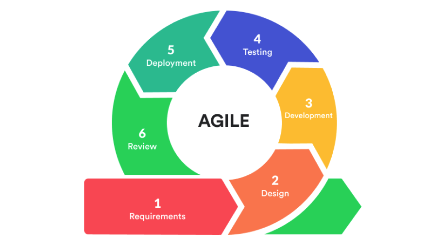
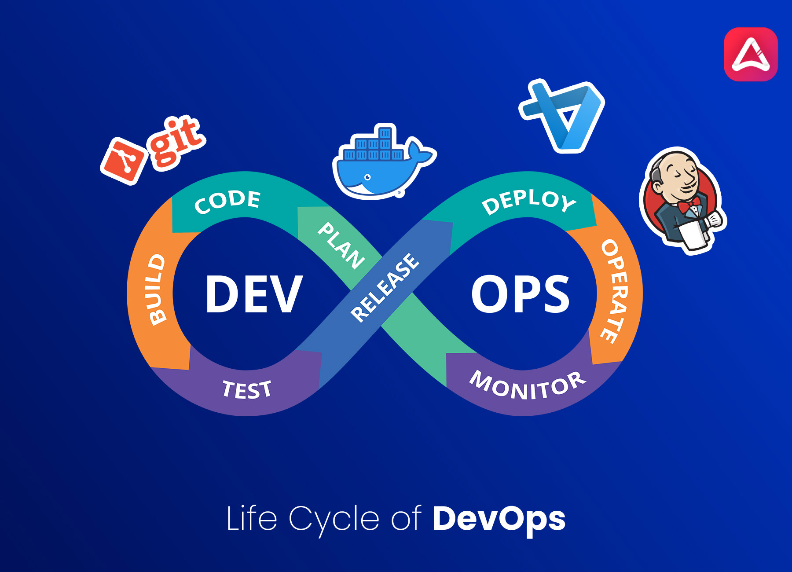

# Lab 01 — DevOps Culture & Introduction to DevSecOps

| | |
|---|---|
| 🕘 **Session** | Day 1 · 09:30 – 10:15 (45 min, includes inauguration) |
| 🧑‍🏫 **Type** | Theory + discussion (no commands in this session) |
| 🎯 **Objective** | Explain **what DevOps is**, **why security must be built in (DevSecOps)**, and **what "shift left" means** — and see the map of every tool you will use in the next two days |

---

## 1. The problem DevOps solves — "the wall of confusion"

Traditionally, software was built by separate teams who rarely talked to each other:

| Team | Their goal | What they say | Measured by |
|---|---|---|---|
| **Developers (Dev)** | Ship new features fast | "Push it to production today!" | Features delivered |
| **Operations (Ops)** | Keep servers stable | "Don't touch production!" | Uptime |
| **Security (Sec)** | Reduce risk | "Stop — we need to review this first." | Zero breaches |

Each team is doing its job — but their goals **conflict**.

```text
 👩‍💻 Dev ── "throws code over the wall" ──▶ 🧱 WALL ──▶ 🛠️ Ops ──▶ 🛡️ Security
   ▲                                                            │
   └────────── security bug found days before release ──────────┘   → rework, delays, blame
```

**Result:** slow releases, finger-pointing ("it works on my machine!"), late-night emergencies, and security
problems discovered when they are most expensive to fix.

---

## 2. What is DevOps?

### First came Agile

Before DevOps, the **Agile** movement fixed the *development* side: instead of one huge release after months of
planning (the **Waterfall** model), teams build software in **short cycles (sprints) of 1–4 weeks**, each going
through the same loop and ending with working software and feedback:


<sub>Source: reference repo vickydevo/DevSecOps-WS</sub>

| | Waterfall | Agile |
|---|---|---|
| Release | Once, at the end (months/years) | Every sprint (weeks) |
| Customer feedback | At the end — often too late | Every cycle |
| Change of plan | Expensive | Expected |

**The gap Agile left:** developers now produced changes every week, but **operations** still deployed slowly and
by hand — and **security** still reviewed at the very end. DevOps closes the Dev ↔ Ops gap; DevSecOps (section 3)
closes the gap with Security.

### DevOps in one sentence

> **DevOps** is a **culture + set of practices + tools** that brings development and operations together so
> software can be delivered **quickly, reliably and repeatedly**.

It is **not** a job title, and **not** a single tool. A useful way to remember the culture is **CALMS**:

| Letter | Stands for | Meaning in simple words |
|---|---|---|
| **C** | Culture | Dev and Ops share responsibility — "we" not "they" |
| **A** | Automation | Machines do repetitive work (build, test, deploy) |
| **L** | Lean | Small changes, delivered often, with less waste |
| **M** | Measurement | Decisions based on data (build time, failures, recovery time) |
| **S** | Sharing | Knowledge, tools and lessons are shared openly |

### The DevOps lifecycle


<sub>Source: reference repo vickydevo/DevSecOps-WS</sub>

### CI vs CD vs CD

| Term | Full form | What is automated | Human approval before production? |
|---|---|---|---|
| **CI** | Continuous **Integration** | Every code change is automatically **built and tested** | — |
| **CD** | Continuous **Delivery** | The tested build is automatically prepared and **ready** to release | ✅ Yes — someone clicks "deploy" |
| **CD** | Continuous **Deployment** | Every change that passes all checks goes **straight to production** | ❌ No — fully automatic |

> 🏭 **Analogy — a toy factory conveyor belt:**
> raw wood (**code**) → cutting machine (**build**) → strength test (**test**) → painting & boxing
> (**release**) → truck to the shop (**deploy**). If the strength test fails, the toy is rejected **immediately**,
> before anyone wastes time painting it. That conveyor belt is a **CI/CD pipeline**.

---

## 3. Why DevOps alone is not enough → DevSecOps

DevOps made delivery **fast**. But if security is still a manual check at the end, then:

> ⚠️ **"DevOps without security just ships vulnerabilities to production faster."**

**DevSecOps** = **Dev**elopment + **Sec**urity + **Op**erations: security checks are **automated and built
into every step** of the pipeline, and **everyone** shares responsibility for security — not only a
separate security team.

### Real incidents and the DevSecOps practice that would have helped

| Incident | What went wrong | DevSecOps practice | Where you practise it |
|---|---|---|---|
| **Equifax (2017)** — personal data of ~147 million people exposed | A known vulnerability in a web framework library (Apache Struts, CVE-2017-5638) was **not patched** for months | **Dependency scanning (SCA)** + fast patching | Day 2 · Lab 05 |
| **Log4Shell (Dec 2021)** — CVE-2021-44228 | A hugely popular Java logging library allowed remote code execution; companies didn't even know **where** they used it | **Know your dependencies** (SCA, image scanning) | Day 1 · Lab 06, Day 2 · Lab 05 |
| **Uber (2016)** — data of ~57 million users exposed | Attackers found **cloud credentials stored in a code repository** | **Secret detection** + secret management | Day 2 · Lab 04 |
| **Codecov (2021)** — supply-chain attack | Attackers modified a script used inside thousands of companies' CI pipelines and stole the **secrets** available there | **Secure CI/CD**, least-privilege credentials | Day 2 · Labs 01 & 06 |

---

## 4. Shift Left — the core idea of DevSecOps

Draw the software lifecycle from left to right. Traditionally, security testing happens on the **right**
(just before release). **Shifting left** means moving security checks **earlier** — into coding, building
and testing.

```text
  ⬅️ SHIFT LEFT — cheap & fast to fix              expensive & slow to fix ➡️
  [ Code ] → [ Commit ] → [ Build ] → [ Test ]  →  [ Release ] → [ Production ]
```

**Why it matters — the cost of a bug grows the later you find it:**

| Found during… | Who finds it | Typical effort to fix |
|---|---|---|
| Writing code (IDE / pre-commit) | The developer, immediately | Minutes |
| CI pipeline (build/scan) | Automated tool, within minutes of the commit | Minutes to hours |
| Testing / staging | QA or security team | Days (context is lost, re-testing needed) |
| **Production** | **Customers or attackers** | Weeks + data breach + reputation damage + legal cost |

> 💡 Industry studies disagree on the exact multiplier, but they all agree on the direction: **the later a
> defect is found, the more it costs.**

---

## 5. The DevSecOps toolchain you will build (map of the next two days)

| Pipeline stage | Security question | Practice | Tool in this workshop | Lab |
|---|---|---|---|---|
| **Code / Commit** | Is the change tracked and reviewed? | Version control, commits, branches | Git, GitHub | Day 1 · 02 |
| **Commit** | Did anyone commit a password or key? | **Secret detection** | **Gitleaks** | Day 2 · 04 |
| **Build** | Does the code compile and pass tests? | Automated build & unit tests | Maven | Day 1 · 04 |
| **Build** | Is *our own code* written securely? | **SAST** — Static Application Security Testing | **SonarQube** | Day 2 · 02–03 |
| **Build** | Do the *libraries we use* have known vulnerabilities? | **SCA** — Software Composition Analysis | **OWASP Dependency-Check** | Day 2 · 05 |
| **Package** | Is the app packaged consistently? | Containerization | Docker, DockerHub | Day 1 · 05 |
| **Package** | Does the *container image* contain vulnerable OS packages or bad configuration? | **Container scanning** | **Trivy** | Day 1 · 06 |
| **Pipeline** | Can insecure code reach production? | **Security gates** — the pipeline **stops** if a check fails | **Jenkins** | Day 2 · 01, 06 |
| **Deploy / Run** | Is the server reachable only on needed ports? | Least privilege, firewalls | AWS Security Groups | Day 1 · 03 |

### Key terms (you will hear them all workshop)

| Term | Meaning |
|---|---|
| **Vulnerability** | A weakness an attacker can exploit |
| **CVE** | *Common Vulnerabilities and Exposures* — a unique ID for a publicly known vulnerability, e.g. `CVE-2021-44228` |
| **CVSS** | A score from **0.0 to 10.0** describing how severe a CVE is (Low → Medium → High → Critical) |
| **Security gate** | A pipeline step that **fails the build** when a security rule is broken |
| **False positive** | A tool reports a problem that isn't really a problem |
| **Least privilege** | Give every user/tool the **minimum** access it needs — nothing more |
| **Attack surface** | Everything an attacker could try to reach (open ports, installed tools, exposed endpoints) |

---

## 6. The application you will secure

Throughout both days you work on **one** application: the **Course Registration Portal** (`workshop-app`) —
a small Java **Spring Boot** web app where students can view courses and register.

It has been written **with realistic security mistakes on purpose** (like real projects often do). Over two days
you will **find them with tools, understand them, fix them, and prove they're fixed** with an automated pipeline:

```text
   Vulnerable app ──► Scan ──► Understand the finding ──► Fix ──► Rescan ──► ✅ Gate passes
```

---

## 💬 Discussion (5 minutes)

1. If your team could deploy **10 times a day**, what would be your biggest fear?
2. Who should be responsible for security in a team — the security team, developers, or everyone? Why?
3. Have you ever pushed code to GitHub without checking what was inside the commit? 🙂

---

## 🎤 Interview questions

<details>
<summary><b>1. What is the difference between DevOps and DevSecOps?</b></summary>

DevOps combines development and operations to deliver software quickly and reliably through automation and
shared responsibility. DevSecOps extends this by **integrating automated security checks into every stage of the
pipeline** and making security a shared responsibility of the whole team, instead of a final manual review.
</details>

<details>
<summary><b>2. What does "shift left" mean?</b></summary>

Moving testing — especially security testing — **earlier** in the software lifecycle (code, commit, build)
so problems are found when they are fastest and cheapest to fix.
</details>

<details>
<summary><b>3. Continuous Delivery vs Continuous Deployment?</b></summary>

Both automate build, test and release preparation. **Delivery** keeps a manual approval before production;
**Deployment** releases every passing change to production automatically.
</details>

<details>
<summary><b>4. What is a security gate?</b></summary>

An automated checkpoint in a pipeline (e.g., "no CRITICAL vulnerabilities", "quality gate passed") that
**fails the pipeline** if the condition is not met, preventing insecure code from moving forward.
</details>

<details>
<summary><b>5. SAST vs SCA — what's the difference?</b></summary>

**SAST** analyses **your own source code** for insecure patterns. **SCA** analyses the **third-party
libraries** your project depends on and matches them against databases of known vulnerabilities (CVEs).
</details>

---

➡️ **Next lab:** [02 — Git Basics & Version Control](02-Git-Basics-and-Version-Control.md)
