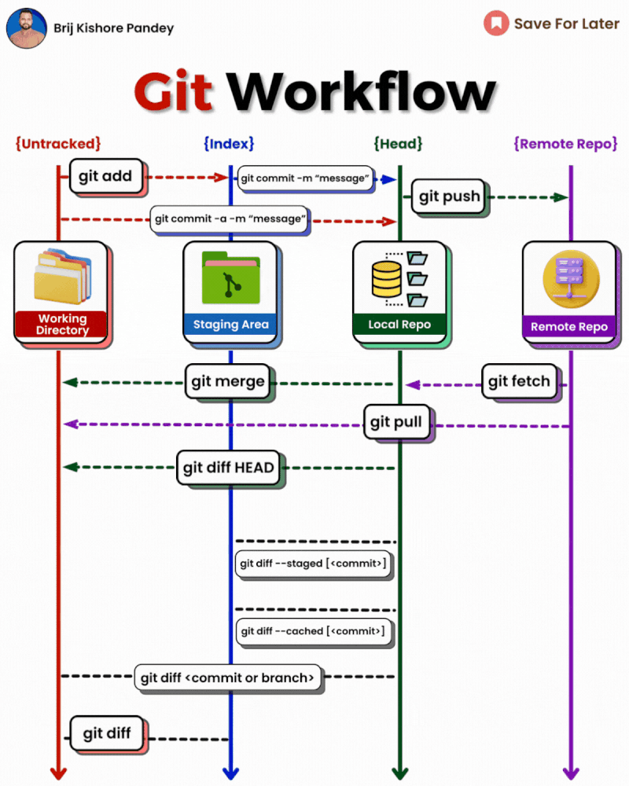
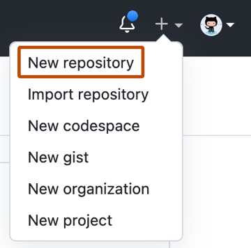
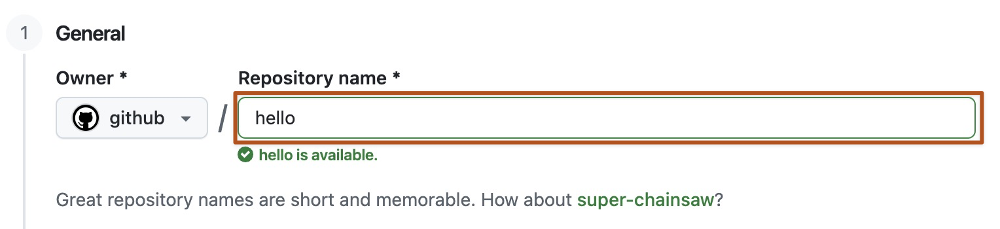
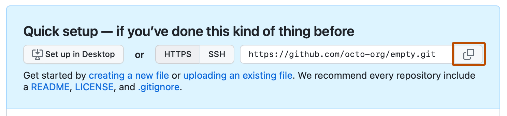

# Lab 02 — Git Basics & Version Control

| | |
|---|---|
| 🕘 **Session** | Day 1 · 10:15 – 11:15 (60 min) |
| ⏱️ **Pacing** | A–C ≈ 25 min · D ≈ 15 min · E ≈ 10 min · F ≈ 10 min |
| 💻 **Where** | Your **laptop** (Git Bash on Windows · Terminal on macOS/Linux) |
| 🎯 **Objective** | Configure Git, create a local repository, record changes with `add` → `commit` → `push`, connect it to GitHub, create and switch **branches**, and see why a committed secret is never really deleted |
| 🏁 **You will have** | A public repo `https://github.com/<YOUR_GITHUB_USERNAME>/git-practice` with 2 branches (`main` and `feature/login`) and a `.gitignore` |

---

## 📋 Before you start

| Requirement | Check command / action | Expected |
|---|---|---|
| Git installed | `git --version` | `git version 2.x` |
| GitHub account + PAT | `workshop-secrets.txt` has a `ghp_...` token | ✔ |
| Workshop folder exists | `cd ~/devsecops && pwd` | `.../devsecops` |

---

## 📚 Concept

### What is version control?

**Version control** records every change to your files so you can see **who changed what, when and why**,
go back to any earlier version, and let many people work on the same project without overwriting each other.

> 🎮 **Analogy:** Git is a **save-game system** for your project. Every *commit* is a save point you can return to.


<sub>Source: reference repo vickydevo/DevSecOps-WS (GitHub/1.Intro_VCS.md)</sub>

### Git vs GitHub

| | **Git** | **GitHub** |
|---|---|---|
| What | A **program** installed on your computer | A **website/service** that hosts Git repositories |
| Works offline? | ✅ Yes | ❌ Needs internet |
| Made by | Linus Torvalds (2005) | GitHub Inc. (owned by Microsoft) |
| Alternatives | — | GitLab, Bitbucket, Azure Repos |

### The four places your code lives


<sub>Source: reference repo vickydevo/DevSecOps-WS</sub>


<sub>Source: reference repo vickydevo/DevSecOps-WS (GitHub/2.stages_branches.md)</sub>

| Area | Meaning | Analogy |
|---|---|---|
| **Working directory** | The files you see and edit | Items on your desk |
| **Staging area** (index) | Changes you have *selected* for the next save | Items placed in a parcel box |
| **Local repository** | Permanent history stored in the hidden `.git` folder | Sealed parcel with a label (commit message) |
| **Remote repository** | A copy of the history on GitHub | Parcel delivered to the warehouse |

> 💡 **Why a staging area?** It lets you choose *exactly* what goes into a commit — e.g., commit your code
> change but **not** the debug file or the file with a password.

---

## 🧾 Syntax reference

| Command | Syntax | What it does |
|---|---|---|
| `git config` | `git config --global <key> "<value>"` | Set your name/email and other settings for every repo on this computer |
| `git init` | `git init` | Turn the current folder into a Git repository (creates `.git/`) |
| `git status` | `git status` | Show which files are untracked / modified / staged |
| `git add` | `git add <file>` · `git add .` | Move changes to the staging area (`.` = everything in this folder) |
| `git commit` | `git commit -m "<message>"` | Save staged changes into history with a message |
| `git log` | `git log --oneline` | Show history, one line per commit |
| `git diff` | `git diff` | Show changes not yet staged |
| `git remote` | `git remote add origin <url>` · `git remote -v` | Link a GitHub repo (named `origin`) / list links |
| `git push` | `git push -u origin <branch>` | Upload commits to GitHub (`-u` remembers the link for next time) |
| `git pull` | `git pull` | Download the latest commits from GitHub into your folder (used in later labs) |
| `git clone` | `git clone <url>` | Download a full copy of a GitHub repository (you'll use it in Lab 04) |
| `git branch` | `git branch` · `git branch <name>` · `git branch -r` · `git branch -a` | List local / create / list remote / list all branches |
| `git switch` | `git switch <branch>` · `git switch -c <branch>` | Move to a branch / create **and** move |
| `git checkout` | `git checkout <branch>` · `git checkout -b <branch>` | Older equivalent of `git switch` (you'll see it in tutorials) |

---

## 🛠️ Lab

### Part A — Configure Git (once per computer) 💻 Laptop

Every commit records **who** made it. Tell Git your name and email (use the **same email** as your GitHub account).

**A1.** Set your name:

```bash
git config --global user.name "Your Full Name"
```

**A2.** Set your email:

```bash
git config --global user.email "you@example.com"
```

**A3.** Make `main` the default branch name for new repositories:

```bash
git config --global init.defaultBranch main
```

✅ **Check:**

```bash
git config --global --list
```

Expected (your values):

```text
user.name=Your Full Name
user.email=you@example.com
init.defaultbranch=main
```

> 💡 `--global` = applies to **all** repositories for your user on this computer. Without it, the setting
> applies only to the current repository.

---

### Part B — Create a local repository 💻 Laptop

**B1.** Create a project folder and enter it:

```bash
mkdir -p ~/devsecops/git-practice
```

```bash
cd ~/devsecops/git-practice
```

**B2.** Initialise Git:

```bash
git init
```

✅ Expected:

```text
Initialized empty Git repository in /c/Users/<you>/devsecops/git-practice/.git/
```

**B3.** See the hidden `.git` folder (this *is* the repository — never edit it by hand):

```bash
ls -la
```

**B4.** Ask Git what's going on:

```bash
git status
```

```text
On branch main

No commits yet

nothing to commit (create/copy files and use "git add" to track)
```

---

### Part C — The add → commit cycle 💻 Laptop

**C1.** Create a file:

```bash
echo "# Git Practice - DevSecOps Workshop" > README.md
```

> 💡 `echo "text" > file` **creates/overwrites** a file with that text. `>>` would **append** instead.

**C2.** Check status — the file is **untracked** (Git sees it but isn't tracking it yet):

```bash
git status
```

```text
Untracked files:
  (use "git add <file>..." to include in what will be committed)
        README.md
```

**C3.** Stage it:

```bash
git add README.md
```

```bash
git status
```

```text
Changes to be committed:
        new file:   README.md
```

**C4.** Commit it:

```bash
git commit -m "Add README"
```

✅ Expected:

```text
[main (root-commit) 1a2b3c4] Add README
 1 file changed, 1 insertion(+)
 create mode 100644 README.md
```

**C5.** Make a second change and look at the difference **before** staging:

```bash
echo "This repo is used to practise Git commands." >> README.md
```

```bash
git diff
```

You'll see the new line marked with `+`.

**C6.** Stage and commit:

```bash
git add .
```

```bash
git commit -m "Describe the purpose of the repo"
```

**C7.** View the history:

```bash
git log --oneline
```

✅ Expected (your commit IDs will differ):

```text
5d6e7f8 (HEAD -> main) Describe the purpose of the repo
1a2b3c4 Add README
```

> 💡 The 7-character code is the short **commit ID (hash)** — a unique fingerprint of that snapshot.
> `HEAD` means "where you are now".

❌ **If** `git commit` without `-m` opens a strange screen (Vim editor): press **Esc**, type `:q!` and press
**Enter**, then run the commit again **with** `-m "message"`.

---

### Part D — Create a GitHub repo and bind it to your local repo 🌐 + 💻

**D1. 🌐 Browser** — On GitHub click **+** (top-right) → **New repository**:



Type the repository name (the screenshot uses `hello`; you type **`git-practice`**):



<sub>Source: GitHub Docs (CC BY 4.0)</sub>

| Field | Value |
|---|---|
| Repository name | `git-practice` |
| Visibility | **Public** |
| Add a README / .gitignore / license | ❌ **Leave all unticked** (your local repo already has history) |

Click **Create repository**. GitHub shows a **Quick setup** page. Copy the **HTTPS** URL with the copy button —
you need it in the next step:



<sub>Source: GitHub Docs (CC BY 4.0)</sub>

**D2. 💻 Laptop** — Link your local repo to GitHub. `origin` is the conventional nickname for the main remote:

```bash
git remote add origin https://github.com/<YOUR_GITHUB_USERNAME>/git-practice.git
```

✅ **Check:**

```bash
git remote -v
```

```text
origin  https://github.com/<YOUR_GITHUB_USERNAME>/git-practice.git (fetch)
origin  https://github.com/<YOUR_GITHUB_USERNAME>/git-practice.git (push)
```

**D3.** Make sure your branch is called `main` (harmless if it already is):

```bash
git branch -M main
```

**D4.** Push your commits to GitHub:

```bash
git push -u origin main
```

**Authentication — what you will see:**

| Your system | What happens | What to do |
|---|---|---|
| 🪟 **Windows (Git Bash)** | A **"Connect to GitHub"** window from *Git Credential Manager* | Click **Sign in with your browser** → **Authorize** — *or* choose the **Token** tab and paste your PAT |
| 🍎 macOS / 🐧 Linux | `Username for 'https://github.com':` then `Password for ...:` | Username = your GitHub username · **Password = your PAT** (`ghp_...`). Nothing appears while pasting — that's normal |

✅ **Expected:**

```text
To https://github.com/<YOUR_GITHUB_USERNAME>/git-practice.git
 * [new branch]      main -> main
branch 'main' set up to track 'origin/main'.
```

✅ **Check 🌐:** refresh the GitHub page — you see `README.md` and **2 commits**.

> 💡 `-u` (`--set-upstream`) remembers that local `main` ↔ `origin/main`. Next time, plain `git push` is enough.

---

### Part E — Branches 💻 Laptop

A **branch** is an independent line of work. You develop a feature on its own branch, so `main` always stays stable.

```text
main:            ●────────●          (README.md only)
                           \
feature/login:              ●        "Add login page placeholder"  (README.md + login.txt)
                     git switch -c feature/login
```

**E1.** Create a branch called `feature/login`:

```bash
git branch feature/login
```

**E2.** List **local** branches (`*` = the branch you are on):

```bash
git branch
```

```text
  feature/login
* main
```

**E3.** Switch to the new branch:

```bash
git switch feature/login
```

```text
Switched to branch 'feature/login'
```

> 💡 Shortcut you'll often see: `git switch -c feature/login` (or the older `git checkout -b feature/login`)
> **creates and switches** in one step.

**E4.** Add work on this branch:

```bash
echo "Login page - coming soon" > login.txt
```

```bash
git add login.txt
```

```bash
git commit -m "Add login page placeholder"
```

**E5.** Push the branch to GitHub:

```bash
git push -u origin feature/login
```

**E6.** List **remote** branches, then **all** branches:

```bash
git branch -r
```

```text
  origin/feature/login
  origin/main
```

```bash
git branch -a
```

```text
* feature/login
  main
  remotes/origin/feature/login
  remotes/origin/main
```

**E7.** Switch back to `main` and list files — **`login.txt` is not there!**

```bash
git switch main
```

```bash
ls
```

```text
README.md
```

> 🤯 The file isn't lost — it lives on the `feature/login` branch. Branches really are separate lines of work.

---

### Part F — "Git never forgets": `.gitignore` and secrets 💻 Laptop

This short experiment explains why **secret detection** (Day 2) exists.

**F1.** Pretend you accidentally saved a password in a file and committed it:

```bash
echo "db_password=Summer@2026" > secrets.txt
```

```bash
git add secrets.txt
```

```bash
git commit -m "Add config"
```

**F2.** You notice the mistake and delete the file:

```bash
git rm secrets.txt
```

```bash
git commit -m "Remove secrets file"
```

```bash
ls
```

The file is gone… **or is it?**

**F3.** Look at the history of that commit:

```bash
git log --oneline
```

Copy the commit ID of **"Add config"** and run (replace `<COMMIT_ID>`):

```bash
git show <COMMIT_ID>
```

✅ **You will see:**

```text
+db_password=Summer@2026
```

> 🚨 **Lesson:** deleting a file does **not** remove it from history. If this had been pushed to GitHub, anyone
> could read it. The only safe response to a leaked secret is: **revoke/rotate it immediately** — then clean up.
> On Day 2, **Gitleaks** will scan history and find exactly this kind of leak.

**F4.** Prevent it next time with a `.gitignore` file — a list of files Git must never track:

```bash
printf "secrets.txt\n*.pem\n.env\n*.log\n" > .gitignore
```

```bash
cat .gitignore
```

```text
secrets.txt
*.pem
.env
*.log
```

**F5.** Test it — create the file again and check status:

```bash
echo "db_password=test" > secrets.txt
```

```bash
git status
```

✅ **Expected:** only `.gitignore` is listed as untracked — **`secrets.txt` is ignored**.

**F6.** Commit and push the `.gitignore`.

> ⚠️ This push also uploads the earlier *"Add config"* commit. That is acceptable **only because the password
> is fake**. With a real secret you would **rotate it first** and never push that history.

```bash
git add .gitignore
```

```bash
git commit -m "Add .gitignore"
```

```bash
git push
```

> ⚠️ `.gitignore` only prevents **future** tracking. It does not remove files that were already committed.

---

## 🛡️ Security angle — summary

| Practice | Why |
|---|---|
| Meaningful commit messages + your real name/email | **Traceability** — who changed what (audit trail) |
| Work on branches | Unfinished or risky changes stay off `main` |
| `.gitignore` for `*.pem`, `.env`, logs | Stops secrets and junk from being committed |
| Token instead of password | Limited scope + expiry + revocable |
| Leaked secret? **Rotate first**, clean later | History is permanent; clones and forks may already exist |

---

## ❌ Common errors

| You see | Why | Fix |
|---|---|---|
| `fatal: not a git repository` | You're not inside the repo folder | `cd ~/devsecops/git-practice` |
| `Author identity unknown *** Please tell me who you are` | Part A was skipped | Run the `git config --global user.name/user.email` commands |
| `remote: Support for password authentication was removed` | You typed your GitHub **password** | Use your **PAT** as the password |
| `remote: Invalid username or token` / `Authentication failed` | Wrong/expired token, or a typo in username | Re-copy the token; on Windows clear old login: Control Panel → Credential Manager → Windows Credentials → remove `git:https://github.com` |
| `error: remote origin already exists` | `git remote add` was run twice | `git remote set-url origin https://github.com/<YOUR_GITHUB_USERNAME>/git-practice.git` |
| `! [rejected] main -> main (fetch first)` | GitHub has commits you don't (e.g., you ticked "Add a README") | `git pull --rebase origin main` then `git push` |
| `error: src refspec main does not match any` | No commits yet, or branch named `master` | Commit first; run `git branch -M main` |
| `warning: LF will be replaced by CRLF` (Windows) | Line-ending conversion | Harmless — ignore |
| Strange screen after `git commit` | Vim opened because `-m` was missing | `Esc` → `:q!` → Enter, then commit with `-m` |

---

## 🏋️ Practice tasks

1. Create a branch `feature/signup` with `git switch -c`, add `signup.txt`, commit and push it. Find it on GitHub
   in the branch drop-down.
2. Run `git log --oneline --graph --all` — explain the picture to your neighbour.
3. Add `*.class` and `target/` to `.gitignore`. Why would a **Java** project ignore these?
4. Edit `README.md`, run `git diff`, then `git add` and `git diff --staged`. What changed between the two outputs?

---

## 🎤 Interview questions

<details>
<summary><b>1. What is the difference between <code>git add</code> and <code>git commit</code>?</b></summary>

`git add` moves changes into the **staging area** (selects them). `git commit` permanently records the staged
changes into the **local repository history** with a message.
</details>

<details>
<summary><b>2. What is a branch, and why use one?</b></summary>

An independent line of work. You build a feature on its own branch so `main` stays stable; `git switch -c <name>`
creates one and moves to it.
</details>

<details>
<summary><b>3. What is <code>origin</code>?</b></summary>

The default nickname for the remote repository you cloned from or linked with `git remote add origin <url>`.
</details>

<details>
<summary><b>4. A developer committed an AWS key and then deleted it in the next commit. Is it safe now?</b></summary>

No. The key is still in the Git history (and in every clone/fork). The key must be **revoked/rotated
immediately**; history can then be cleaned with tools like `git filter-repo`, but rotation is the real fix.
</details>

---

➡️ **Next lab:** [03 — EC2 Setup & Linux Basics](03-EC2-Setup-and-Linux-Basics.md)
