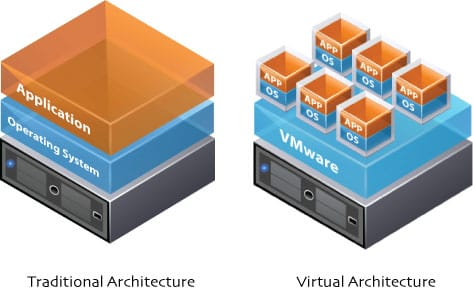
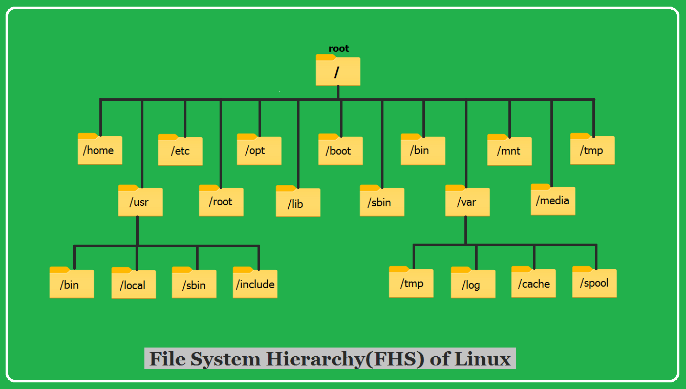

# Lab 03 — EC2 Setup & Linux Basics

| | |
|---|---|
| 🕘 **Session** | Day 1 · 11:30 – 12:30 (60 min) |
| 🌐☁️ **Where** | AWS Console (browser) → then your **EC2 server** over SSH |
| 🎯 **Objective** | Launch an Ubuntu server on AWS, connect to it securely with SSH, add swap memory, and use the essential Linux commands every DevSecOps engineer needs |
| 🏁 **You will have** | A running EC2 instance **`devsecops-main`** you can log in to, with 2 GB swap enabled |

---

## 📋 Before you start

| Requirement | Check |
|---|---|
| AWS account active | You can open the EC2 dashboard (Prerequisite 01) |
| Region = **Asia Pacific (Mumbai)** | Top-right of AWS console |
| `ssh -V` works on laptop | Prerequisite 04 |
| `~/devsecops` folder exists | `ls ~/devsecops` |

---

## 📚 Concept — the parts of an EC2 server



<sub>Source: reference repo vickydevo/DevSecOps-WS</sub>

| AWS term | What it is | Our choice | Analogy |
|---|---|---|---|
| **EC2 instance** | A virtual server in AWS | `devsecops-main` | A rented computer |
| **AMI** (Amazon Machine Image) | The operating system template the server starts from | **Ubuntu Server 24.04 LTS** | The OS installation DVD |
| **Instance type** | CPU + memory size | **`t3.micro`** (2 vCPU, 1 GB RAM) today · resized tomorrow | Laptop model/spec |
| **Key pair** | SSH lock (public key, on server) + key (private `.pem`, on laptop) | `devsecops-key` | Door lock + your only key |
| **Security group** | A **firewall** that decides which ports can be reached from the internet | `devsecops-main-sg` | The building's security guard with a guest list |
| **EBS volume** | The server's hard disk | **25 GiB gp3** | The SSD inside the computer |
| **Public IPv4 address** | The internet address of your server | Changes after every Stop/Start | Your phone number (changes if you get a new SIM) |

### Ports we open (and why)


| Port | Protocol | Used by | When |
|---|---|---|---|
| **22** | SSH | You — remote login | Day 1 & 2 |
| **8081** | HTTP | The workshop app (`workshop-app`) | Day 1 & 2 |
| **8080** | HTTP | Jenkins | Day 2 |

> 🛡️ **Least privilege:** every open port is a door an attacker can knock on. We open **only** what the labs need.
> In this workshop the source is `0.0.0.0/0` (*anywhere*) because many college networks change their public IP
> during the day; in a real company you would restrict sources to your office/VPN IP range.

---

## 🛠️ Lab

### Part A — Launch the instance 🌐 Browser

**A1.** In the AWS console, confirm the region (top-right) is **Asia Pacific (Mumbai)**.

**A2.** Search **EC2** → open it → click **Launch instance** (orange button).


<sub>Source: reference repo vickydevo/DevSecOps-WS (LaunchEe2.md)</sub>

**A3. Name and tags**

| Field | Value |
|---|---|
| Name | `devsecops-main` |

**A4. Application and OS Images (AMI)**

1. Click the **Ubuntu** tile.
2. In the dropdown, choose **Ubuntu Server 24.04 LTS (HVM), SSD Volume Type**.
3. **Architecture:** `64-bit (x86)`.

> ⚠️ Do **not** pick *Ubuntu 26.04* or *Arm*. All commands in this guide are tested for **24.04 x86**.


<sub>Source: reference repo vickydevo/DevSecOps-WS (LaunchEe2.md) — type the name **devsecops-main**</sub>

**A5. Instance type** → search and select **`t3.micro`**.


<sub>Source: reference repo vickydevo/DevSecOps-WS (LaunchEe2.md) — ⚠️ the screenshot may show another type; choose **t3.micro**</sub>


**A6. Key pair (login)** → **Create new key pair**:

| Field | Value |
|---|---|
| Key pair name | `devsecops-key` |
| Key pair type | **RSA** |
| Private key file format | **.pem** (works with Git Bash, PowerShell, macOS and Linux) |

Click **Create key pair** → your browser downloads **`devsecops-key.pem`**.

> ⚠️ **This is the only time AWS gives you this file.** Lose it = lose access to the server.


<sub>Source: reference repo vickydevo/DevSecOps-WS (LaunchEe2.md) — name it **devsecops-key**</sub>

**A7. Network settings** → click **Edit** (top-right of that panel):

| Setting | Value |
|---|---|
| Auto-assign public IP | **Enable** |
| Firewall (security groups) | **Create security group** |
| Security group name | `devsecops-main-sg` |
| Description | `DevSecOps workshop - main server` |

Inbound rules — the first rule (SSH) already exists. Set it, then click **Add security group rule** twice:

| # | Type | Port range | Source type | Description |
|---|---|---|---|---|
| 1 | **ssh** | 22 | **Anywhere** (`0.0.0.0/0`) | `SSH` |
| 2 | **Custom TCP** | **8081** | **Anywhere** | `workshop-app` |
| 3 | **Custom TCP** | **8080** | **Anywhere** | `Jenkins (Day 2)` |

> 💡 AWS shows a yellow warning *"Rules with source of 0.0.0.0/0 allow all IP addresses…"* — that's expected
> for this lab (see the security note above).

**A8. Configure storage** → change **8** GiB to **`25`** GiB, volume type **gp3**.

> 💡 Docker images, Maven libraries and vulnerability databases need space. 8 GiB fills up by Day 2.


<sub>Source: reference repo vickydevo/DevSecOps-WS (LaunchEe2.md)</sub>

> ⚠️ This reference screenshot shows the **default** firewall options and **20 GiB**. For this workshop: click **Edit** in Network settings, add the **8081** and **8080** rules (A7) and set storage to **25 GiB** (A8).


**A9.** Check the **Summary** panel on the right:

```text
Number of instances: 1
Software Image: Ubuntu Server 24.04 LTS
Instance type: t3.micro
Firewall: New security group
Storage: 1 volume(s) - 25 GiB
```

→ Click **Launch instance** → **View all instances**.

**A10.** Wait until **Instance state = Running** and **Status check = 3/3 checks passed** (≈ 1–2 minutes;
click the 🔄 refresh button).

**A11.** Click your instance → in the **Details** tab copy **Public IPv4 address** → paste it into
`workshop-secrets.txt` as `devsecops-main IP`. From now on this is **`<MAIN_SERVER_IP>`**.

✅ **Check:** instance `devsecops-main` · Running · `t3.micro` · has a public IPv4 address.

---

### Part B — Connect with SSH 💻 Laptop

**B1.** Move the key from Downloads into your workshop folder:

```bash
mv ~/Downloads/devsecops-key.pem ~/devsecops/
```

```bash
cd ~/devsecops
```

```bash
ls -l devsecops-key.pem
```

**B2.** Lock the key so only you can read it (SSH refuses keys that others can read):

```bash
chmod 400 devsecops-key.pem
```

> 💡 `400` = owner can **read**, nobody else can do anything. (Using **PowerShell**? Use the three `icacls`
> commands from Prerequisite 04, Step 3 instead.)

**B3.** Connect (replace the IP):

```bash
ssh -i devsecops-key.pem ubuntu@<MAIN_SERVER_IP>
```

| Part | Meaning |
|---|---|
| `ssh` | The SSH client program |
| `-i devsecops-key.pem` | **i**dentity file — your private key |
| `ubuntu` | Default username on Ubuntu AMIs |
| `@<MAIN_SERVER_IP>` | The server's address |

**B4.** The first time, SSH asks you to confirm the server's identity:

```text
Are you sure you want to continue connecting (yes/no/[fingerprint])?
```

Type **`yes`** and press Enter.

✅ **Expected — you are now INSIDE the server:**

```text
Welcome to Ubuntu 24.04.x LTS (GNU/Linux ... x86_64)
...
ubuntu@ip-172-31-xx-xx:~$
```

**Reading the prompt** `ubuntu@ip-172-31-xx-xx:~$`:

| Part | Meaning |
|---|---|
| `ubuntu` | Logged-in user |
| `ip-172-31-xx-xx` | Server's hostname (based on its **private** IP) |
| `~` | Current folder (your home: `/home/ubuntu`) |
| `$` | Normal user (`#` would mean **root**) |

> 🔁 From now on, every ☁️ **EC2** command runs in **this** window. Keep a second Git Bash window open for 💻 laptop commands.

#### 🆘 SSH doesn't work? Use the browser instead (EC2 Instance Connect)

Some college networks block port 22. You can still work through your browser:

🌐 EC2 → Instances → select `devsecops-main` → **Connect** → tab **EC2 Instance Connect** →
Username `ubuntu` → **Connect**. A terminal opens in a new browser tab — all ☁️ commands work there too.

---

### Part C — Add 2 GB swap (required on t3.micro) ☁️ EC2

`t3.micro` has only **1 GB RAM**. Building a Java app with Maven needs more. **Swap** is disk space Linux uses as
emergency memory — slower than RAM, but it prevents *"Killed"* / out-of-memory crashes.

**C1.** Check memory **before**:

```bash
free -h
```

```text
               total        used        free      shared  buff/cache   available
Mem:           914Mi       ...
Swap:             0B          0B          0B
```

**C2.** Create a 2 GB file for swap:

```bash
sudo fallocate -l 2G /swapfile
```

**C3.** Only root may read it (it can contain memory contents — security!):

```bash
sudo chmod 600 /swapfile
```

**C4.** Format it as swap:

```bash
sudo mkswap /swapfile
```

**C5.** Turn it on:

```bash
sudo swapon /swapfile
```

**C6.** Make it permanent (survives reboot / stop-start):

```bash
echo '/swapfile none swap sw 0 0' | sudo tee -a /etc/fstab
```

✅ **Check:**

```bash
free -h
```

```text
Swap:          2.0Gi          0B        2.0Gi
```

---

### Part D — Update the package list ☁️ EC2

```bash
sudo apt update
```

✅ **Expected (last lines):**

```text
Reading package lists... Done
Building dependency tree... Done
XX packages can be upgraded. Run 'apt list --upgradable' to see them.
```

> 💡 `apt update` refreshes the **list** of available software — it doesn't install anything.
> We skip `apt upgrade` in the workshop because it can take 10+ minutes and may show pink pop-up screens.
> In production you would patch regularly.

---

### Part E — Linux essentials (hands-on) ☁️ EC2

#### E1. The Linux file system — "everything is a file, starting at `/`"


<sub>Source: reference repo vickydevo/DevSecOps-WS</sub>

| Folder | Holds | You'll use it for |
|---|---|---|
| `/home/ubuntu` (`~`) | Your files | Cloning the app |
| `/etc` | Configuration | `/etc/fstab` (you just edited it), `/etc/os-release` |
| `/var/log` | Logs | Troubleshooting services |
| `/var/lib` | Application data | Jenkins lives in `/var/lib/jenkins` (Day 2) |
| `/opt` | Extra software/data | Dependency-Check database (Day 2) |
| `/tmp` | Temporary files | Scratch work |

#### E2. Navigation

```bash
pwd
```
→ `/home/ubuntu` — **p**rint **w**orking **d**irectory (where am I?)

```bash
ls
```
→ lists files (empty for now)

```bash
ls -la /etc | head -5
```
→ `-l` long format, `-a` include hidden files; `| head -5` shows only the first 5 lines

```bash
cd /var/log
```

```bash
pwd
```
→ `/var/log`

```bash
cd ~
```
→ back home (`cd` alone does the same)

| Path type | Example | Meaning |
|---|---|---|
| Absolute | `/var/log` | Starts from `/` — works from anywhere |
| Relative | `labs/notes.txt` | Starts from where you are now |
| `.` / `..` | `cd ..` | Current folder / parent folder |

#### E3. Files and folders

```bash
mkdir -p ~/labs/linux
```
→ make directory (`-p` = create parents too, no error if exists)

```bash
cd ~/labs/linux
```

```bash
echo "Hello DevSecOps" > notes.txt
```

```bash
echo "Second line" >> notes.txt
```

```bash
cat notes.txt
```

```text
Hello DevSecOps
Second line
```

```bash
cp notes.txt notes-backup.txt
```
→ copy

```bash
mv notes-backup.txt old-notes.txt
```
→ move / **rename**

```bash
ls
```
→ `notes.txt  old-notes.txt`

```bash
rm old-notes.txt
```
→ delete (⚠️ no Recycle Bin in Linux!)

#### E4. Edit a file with `nano`

```bash
nano notes.txt
```

Add a line `Edited with nano`. Then: **Ctrl + O** → Enter (save) → **Ctrl + X** (exit).

```bash
cat notes.txt
```

> 💡 The bottom of the nano screen shows shortcuts: `^O` means **Ctrl + O**.

#### E5. Search and read

```bash
grep "DevSecOps" notes.txt
```
→ prints matching lines

```bash
cat /etc/os-release | grep PRETTY_NAME
```

```text
PRETTY_NAME="Ubuntu 24.04.x LTS"
```

> 💡 `|` (**pipe**) sends the output of the left command into the right command. This is how small Linux
> tools are combined into powerful one-liners.

```bash
tail -n 5 /var/log/syslog
```
→ last 5 lines of the system log (`tail -f` would **follow** it live — stop with **Ctrl + C**)

#### E6. Permissions — who can do what

```bash
ls -l notes.txt
```

```text
-rw-rw-r-- 1 ubuntu ubuntu 45 Oct  5 12:10 notes.txt
```

```text
-   rw-   rw-   r--   1   ubuntu   ubuntu
│   │     │     │         │        └── group owner
│   │     │     │         └─────────── user owner
│   │     │     └── others: read
│   │     └──────── group: read, write
│   └────────────── owner (user): read, write
└── type: - = file, d = directory
```

| Letter | Number | On a file | On a directory |
|---|---|---|---|
| `r` | 4 | read contents | list contents |
| `w` | 2 | modify | create/delete files inside |
| `x` | 1 | run as program | enter (`cd`) |

Add the numbers per group: `rwx`=7, `rw-`=6, `r-x`=5, `r--`=4, `---`=0.

| Mode | Meaning | Typical use |
|---|---|---|
| `400` | owner read only | **SSH private keys** (`.pem`) |
| `600` | owner read/write | Secret files, swapfile |
| `644` | owner rw, everyone read | Normal files |
| `755` | owner rwx, everyone rx | Scripts, programs, directories |
| `777` | **everyone can do everything** | ⚠️ **Almost never correct** — a classic security finding |

Try it:

```bash
echo 'echo "Script works!"' > hello.sh
```

```bash
./hello.sh
```
→ ❌ `Permission denied` (no `x` permission yet)

```bash
chmod 755 hello.sh
```

```bash
./hello.sh
```
→ ✅ `Script works!`

```bash
chmod u-x hello.sh
```
→ **symbolic** form: remove (`-`) execute (`x`) from the user/owner (`u`). Others: `g` group, `o` others, `a` all; `+` add, `=` set exactly.

```bash
ls -l hello.sh
```
→ `-rw-r-xr-x` — owner can no longer execute it.

**Change owner** (needs `sudo`):

```bash
sudo chown root:root hello.sh
```

```bash
ls -l hello.sh
```
→ owner is now `root`.

> 🛡️ In Lab 06 a scanner will flag a Dockerfile that does `chmod 777` and runs as `root`. Now you know why that's dangerous.

#### E7. Users, groups and `sudo`

```bash
whoami
```
→ `ubuntu`

```bash
id
```
→ `uid=1000(ubuntu) gid=1000(ubuntu) groups=1000(ubuntu),4(adm),27(sudo),...`

```bash
cat /etc/shadow
```
→ ❌ `Permission denied` — password hashes are root-only

```bash
sudo head -2 /etc/shadow
```
→ works — `sudo` = "**s**uper**u**ser **do**": run **one** command as root.

> 🛡️ Use `sudo` only when needed. Never work as root all day (`sudo su`) — one wrong `rm` can destroy the system.

#### E8. Processes, services and ports

```bash
ps aux | head -5
```
→ running **processes** (programs currently running)

```bash
top
```
→ live CPU/memory view. Press **q** to quit.

```bash
systemctl status ssh
```
→ the SSH **service** (a program that runs in the background). Look for `Active: active (running)`. Press **q** to exit.

| Command | Purpose |
|---|---|
| `sudo systemctl start <service>` | Start now |
| `sudo systemctl stop <service>` | Stop now |
| `sudo systemctl restart <service>` | Stop + start |
| `sudo systemctl enable <service>` | Start automatically at boot |
| `journalctl -u <service> -n 50` | Last 50 log lines of a service |

```bash
sudo ss -tulpn
```
→ which programs are **listening** on which **ports**. You'll see `:22` (sshd). Later today you'll see `:8081` (the app).

| Flag | Meaning |
|---|---|
| `-t` / `-u` | TCP / UDP |
| `-l` | listening only |
| `-p` | show the process |
| `-n` | numbers, not names |

#### E9. Disk, memory and system info

```bash
df -h /
```
→ disk usage of the root disk (should show ~25G size)

```bash
free -h
```
→ RAM + swap

```bash
du -sh ~/labs
```
→ size of a folder

```bash
uname -a
```
→ kernel/OS info

```bash
nproc
```
→ number of CPUs

#### E10. Installing software with `apt`

```bash
sudo apt install -y tree
```

```bash
tree ~/labs
```

| Command | Purpose |
|---|---|
| `sudo apt update` | Refresh the list of available packages |
| `sudo apt install -y <pkg>` | Install (`-y` = auto-answer yes) |
| `sudo apt remove <pkg>` | Uninstall |
| `apt list --installed \| grep <pkg>` | Is it installed? |

---

### Part F — Disconnect and reconnect (practice) 💻 + ☁️

☁️ Leave the server:

```bash
exit
```

→ prompt changes back to your laptop.

💻 Reconnect (press **↑** to reuse the earlier command):

```bash
ssh -i devsecops-key.pem ubuntu@<MAIN_SERVER_IP>
```

✅ You're back in. Stay connected for Lab 04.

---

## 🛡️ Security angle — summary

| What you did | Security principle |
|---|---|
| Private key `chmod 400`, never shared | Protect credentials |
| Opened only ports 22, 8080, 8081 | Minimise attack surface |
| Swapfile `chmod 600` | Least privilege on sensitive files |
| Used `sudo` per command, not a root shell | Least privilege for users |
| Learned that `777` = anyone can modify | You'll recognise this as a finding in scans |

---

## ❌ Common errors

| You see | Why | Fix |
|---|---|---|
| `WARNING: UNPROTECTED PRIVATE KEY FILE!` · `bad permissions` | Key readable by others | Git Bash/macOS/Linux: `chmod 400 devsecops-key.pem` · PowerShell: `icacls` commands (Prerequisite 04) |
| `Permission denied (publickey)` | Wrong user, wrong key, or wrong folder | Use `ubuntu@...`; run the command **inside** `~/devsecops`; key must be `devsecops-key.pem` |
| `Connection timed out` | Port 22 not open, wrong IP, or network blocks SSH | Check security group rule 1; re-copy IP; try **EC2 Instance Connect** |
| `No such file or directory` for the `.pem` | You're in the wrong folder | `cd ~/devsecops` then `ls` |
| `Could not resolve hostname <main_server_ip>` | Placeholder not replaced | Replace the **whole** `<MAIN_SERVER_IP>` including `< >` |
| Instance list is empty | Wrong region | Switch to **Asia Pacific (Mumbai)** |
| `fallocate failed: Text file busy` | Swap already created and active | Already done — check with `free -h` |
| `E: Could not get lock /var/lib/dpkg/lock-frontend` | Ubuntu is installing updates automatically right after boot | Wait 1–2 minutes and retry |
| Pressing Ctrl+V inserts `^V` | Wrong paste shortcut | Git Bash: **Shift+Insert** or right-click → Paste |

---

## 🏋️ Practice tasks

1. Create `~/labs/secret.txt` and set permissions so **only you** can read and write it. Prove it with `ls -l`.
2. Find how many lines in `/var/log/syslog` contain `ssh` (hint: `grep -c`).
3. Which process is listening on port 22? (hint: `sudo ss -tulpn | grep :22`)

---

## 🎤 Interview questions

<details>
<summary><b>1. What is a security group in AWS?</b></summary>

A virtual firewall attached to an EC2 instance that controls **inbound** and **outbound** traffic by port,
protocol and source/destination IP. It is **stateful** — if inbound traffic is allowed, the response is
automatically allowed out.
</details>

<details>
<summary><b>2. Why does SSH refuse a private key with permissions 644?</b></summary>

Because other users on the machine could read it. SSH enforces that private keys are readable only by their owner (e.g. `400` or `600`).
</details>

<details>
<summary><b>3. What does <code>chmod 750 app.sh</code> mean?</b></summary>

Owner: read+write+execute (7); group: read+execute (5); others: no access (0).
</details>

<details>
<summary><b>4. What is swap, and why did we add it?</b></summary>

Disk space used as overflow memory when RAM is full. `t3.micro` has 1 GB RAM; Maven builds need more, so swap
prevents the build process from being killed by the out-of-memory killer.
</details>

<details>
<summary><b>5. Difference between Stop and Terminate for an EC2 instance?</b></summary>

**Stop** shuts the server down but keeps its disk (you can start it again; the public IP changes).
**Terminate** deletes the instance and (by default) its root disk — permanently.
</details>

---

➡️ **Next lab:** [04 — Application Deployment on EC2](04-Application-Deployment-on-EC2.md)
