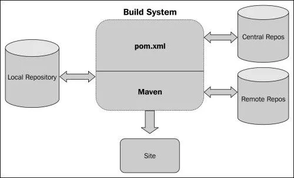

# Lab 04 — Application Deployment on EC2 (+ Maven Essentials)

| | |
|---|---|
| 🕘 **Session** | Day 1 · 12:30 – 13:30 (60 min) |
| ☁️ **Where** | Your EC2 server `devsecops-main` (plus GitHub in the browser) |
| 🎯 **Objective** | Fork and clone the workshop application, understand its structure and `pom.xml`, build it with **Maven**, and run it on EC2 so it opens in your browser |
| 🏁 **You will have** | The **Course Registration Portal** running at `http://<MAIN_SERVER_IP>:8081` |

---

## 📋 Before you start

| Requirement | Check (☁️ EC2) | Expected |
|---|---|---|
| Logged in to EC2 | prompt looks like `ubuntu@ip-172-31-...:~$` | ✔ |
| Swap active | `free -h` | `Swap: 2.0Gi` |
| Port 8081 open | Security group rule from Lab 03 | ✔ |

---

## 📚 Concept

### What are we deploying?

**`workshop-app`** is a **Java 21 + Spring Boot** web application — the *Course Registration Portal*.

| Layer | Technology | Role |
|---|---|---|
| Language | Java 21 | The code |
| Framework | Spring Boot 3 | Web server (embedded **Tomcat**), routing, database access — all built in |
| Web pages | Thymeleaf templates | HTML pages |
| Database | H2 (in-memory) | Stores courses and registrations **in RAM** — no DB installation needed, data resets on restart |
| Build tool | **Maven** | Downloads libraries, compiles, tests and packages the app into **one `.jar` file** |

### What is Maven? (build automation)

Without a build tool you would have to manually download ~60 library `.jar` files, compile hundreds of `.java`
files in the right order, run tests and zip everything up — every single time. **Maven automates all of it**
from one configuration file: **`pom.xml`** (*Project Object Model*).

> 🍳 **Analogy:** `pom.xml` is a **recipe**: it lists the ingredients (**dependencies**) and the cooking
> steps (**plugins/lifecycle**). Maven is the **chef** that follows it exactly the same way on every machine.

#### Maven key ideas

| Idea | Meaning |
|---|---|
| **GAV coordinates** | Every project/library is identified by **G**roupId + **A**rtifactId + **V**ersion, e.g. `org.apache.commons : commons-text : 1.9` |
| **Dependency** | A library your code uses. Maven downloads it (and *its* dependencies — **transitive** dependencies) automatically |
| **Maven Central** | The public online repository Maven downloads libraries from |
| **Local repository** `~/.m2/repository` | Download cache on your machine — the second build is much faster |
| **Plugin** | Does the actual work (compiler plugin compiles, surefire plugin runs tests, spring-boot plugin builds the runnable jar…) |
| **Artifact** | The output of the build — here `target/workshop-app.jar` |
| **Convention over configuration** | Source code always in `src/main/java`, tests in `src/test/java`, output in `target/` — so you don't need to configure it |



<sub>Source: reference repo vickydevo/DevSecOps-WS</sub>


#### The Maven build lifecycle

Running a phase runs **all phases before it** too.


<sub>Source: reference repo vickydevo/DevSecOps-WS (maven/IntroMAVEN.md)</sub>

| Phase | What happens | Output |
|---|---|---|
| `validate` | Checks `pom.xml` is correct | — |
| `compile` | Compiles `src/main/java` | `target/classes/` |
| `test` | Compiles & runs unit tests in `src/test/java` | `target/surefire-reports/` |
| `package` | Bundles everything into a jar | `target/workshop-app.jar` |
| `verify` | Extra checks (coverage reports, quality checks) | `target/site/jacoco/` |
| `install` | Copies the jar into `~/.m2/repository` (for other local projects) | — |
| `deploy` | Uploads the jar to a shared remote repository (e.g. Nexus) | — |
| `clean` *(separate lifecycle)* | Deletes the `target/` folder for a fresh build | — |

> 🛡️ **Why DevSecOps cares about Maven:** every dependency is **someone else's code** running inside your app.
> If one of them has a known vulnerability, **your** app is vulnerable. On Day 2, **OWASP Dependency-Check**
> reads this same `pom.xml` to find them.

---

## 🧾 Syntax reference

| Command | What it does |
|---|---|
| `java -version` | Show Java runtime version |
| `mvn -v` | Show Maven version (and which Java it uses) |
| `mvn clean` | Delete `target/` |
| `mvn compile` | Compile only |
| `mvn test` | Compile + run tests |
| `mvn clean package` | Fresh build → runnable jar |
| `mvn clean package -DskipTests` | Build without running tests (faster, **not** for pipelines) |
| `mvn dependency:tree` | Show all dependencies, including transitive ones |
| `java -jar <file>.jar` | Run a Spring Boot application |
| `nohup <cmd> > app.log 2>&1 &` | Run in the background, keep running after logout, write output to `app.log` |
| `pkill -f <pattern>` | Stop processes whose command line matches the pattern |

---

## 🛠️ Lab

### Part A — Install Java 21, Maven and Git ☁️ EC2

**A1.** Install all three in one command:

```bash
sudo apt install -y openjdk-21-jdk-headless maven git
```

> ⏳ Takes 1–3 minutes. *headless* = without desktop/GUI libraries (a server has no screen).

✅ **Check Java:**

```bash
java -version
```

```text
openjdk version "21.0.x" ...
```

✅ **Check Maven:**

```bash
mvn -v
```

```text
Apache Maven 3.8.x
...
Java version: 21.0.x, vendor: Ubuntu, runtime: /usr/lib/jvm/java-21-openjdk-amd64
```

> ⚠️ The line **`Java version: 21`** is important. If it shows another version, see *Common errors*.

✅ **Check Git:**

```bash
git --version
```

**A2.** Tell Git who you are **on this server** (you'll commit from here in Lab 06):

```bash
git config --global user.name "Your Full Name"
```

```bash
git config --global user.email "you@example.com"
```

---

### Part B — Fork the application on GitHub 🌐 Browser

**Forking** creates **your own copy** of someone else's repository under your account. You can change it freely
without affecting the original — and tomorrow your Jenkins pipeline will build **your** fork.

1. Open **`https://github.com/<TRAINER_GITHUB>/workshop-app`** (your trainer will share the exact link).
2. Click **Fork** (top-right).
3. Owner = **your username** · Repository name = `workshop-app` · ✅ *Copy the `main` branch only* →
   **Create fork**.

✅ **Check:** the page title now reads **`<YOUR_GITHUB_USERNAME>/workshop-app`** with
*"forked from `<TRAINER_GITHUB>/workshop-app`"* underneath.

| Fork | Clone |
|---|---|
| Happens on **GitHub** (server side) | Happens on **your machine** |
| Copies a repo **into your GitHub account** | Downloads a repo **to a computer** |

---

### Part C — Clone your fork onto EC2 ☁️ EC2

**C1.** Go to your home folder and clone **your fork** (not the trainer's):

```bash
cd ~
```

```bash
git clone https://github.com/<YOUR_GITHUB_USERNAME>/workshop-app.git
```

✅ **Expected:**

```text
Cloning into 'workshop-app'...
...
Resolving deltas: 100% (...), done.
```

**C2.** Enter the project:

```bash
cd ~/workshop-app
```

```bash
ls -la
```

---

### Part D — Tour the project ☁️ EC2

```bash
tree -L 3 -I 'target'
```

```text
.
├── Dockerfile-bad              ← intentionally insecure Dockerfile (used in Lab 06)
├── README.md
├── pom.xml                     ← Maven recipe
└── src
    ├── main
    │   ├── java                ← application source code
    │   └── resources           ← configuration, HTML templates, SQL seed data
    └── test
        └── java                ← automated unit tests
```

**D1.** See the application's configuration:

```bash
cat src/main/resources/application.properties
```

Find the line:

```text
server.port=8081
```

→ That's why the app is reached on port **8081**.

> 👀 Notice anything in this file that should **not** be there? Keep it in mind — on Day 2, **Gitleaks** will
> find it.

**D2.** Look at the `pom.xml` — the important parts:

```bash
less pom.xml
```

(Use ↑/↓ or Space to scroll, **q** to quit.)

```xml
<!-- 1. Inherit sensible defaults + tested library versions from Spring Boot -->
<parent>
    <groupId>org.springframework.boot</groupId>
    <artifactId>spring-boot-starter-parent</artifactId>
    <version>3.5.16</version>
</parent>

<!-- 2. This project's own GAV coordinates -->
<groupId>com.workshop</groupId>
<artifactId>workshop-app</artifactId>
<version>1.0.0</version>

<!-- 3. Java version -->
<properties>
    <java.version>21</java.version>
</properties>

<!-- 4. Libraries the app needs (examples) -->
<dependencies>
    <dependency>
        <groupId>org.springframework.boot</groupId>
        <artifactId>spring-boot-starter-web</artifactId>   <!-- web server + REST -->
    </dependency>
    <dependency>
        <groupId>org.apache.commons</groupId>
        <artifactId>commons-text</artifactId>
        <version>1.9</version>                              <!-- 👀 remember this for Day 2 -->
    </dependency>
    <dependency>
        <groupId>org.springframework.boot</groupId>
        <artifactId>spring-boot-starter-test</artifactId>
        <scope>test</scope>                                 <!-- only used when running tests -->
    </dependency>
</dependencies>

<!-- 5. Build settings: name of the jar + plugins -->
<build>
    <finalName>workshop-app</finalName>                     <!-- → target/workshop-app.jar -->
    <plugins> ... spring-boot-maven-plugin, jacoco, sonar, dependency-check ... </plugins>
</build>
```

> 💡 Dependencies without a `<version>` get their version from the Spring Boot **parent** — it maintains a
> tested set of versions so they work together.

---

### Part E — Build the application with Maven ☁️ EC2

**E1.** Run the full build (clean → compile → test → package):

```bash
mvn clean package
```

> ⏳ **First build: 3–6 minutes** — Maven downloads ~100 MB of libraries into `~/.m2/repository`.
> You'll see many `Downloading from central: ...` lines. That's normal. Later builds take ~30 seconds.

✅ **Expected (near the end):**

```text
[INFO] Tests run: X, Failures: 0, Errors: 0, Skipped: 0
...
[INFO] BUILD SUCCESS
[INFO] Total time:  0X:XX min
```

**E2.** Find the artifact:

```bash
ls -lh target/*.jar
```

```text
-rw-rw-r-- 1 ubuntu ubuntu  2xM ... target/workshop-app.jar
```

> 💡 This single file contains your code **and** all its libraries **and** an embedded Tomcat web server —
> a "fat jar". That's why it can run with just `java -jar`.

**E3.** (Understanding) See every library inside the app, including transitive ones:

```bash
mvn dependency:tree | head -40
```

Look for `org.apache.commons:commons-text:jar:1.9` and the `+-` / `\-` tree lines showing
"library X pulled in library Y".

---

### Part F — Run the application (foreground) ☁️ EC2

**F1.** Start it:

```bash
java -jar target/workshop-app.jar
```

✅ **Expected (wait ~10–20 seconds):**

```text
 :: Spring Boot ::               (v3.5.16)
...
Tomcat started on port 8081 (http) with context path '/'
Started WorkshopApplication in X.XXX seconds
```

**F2. 🌐 Browser** — open:

```text
http://<MAIN_SERVER_IP>:8081
```

✅ You see the **Course Registration Portal** with a list of courses. **Register yourself** for a course and
check the confirmation page. 🎉 *Your application is live on the internet.*

**F3.** Back in the terminal, stop the app with **Ctrl + C**.

> 💡 While running in the **foreground**, the app is tied to your terminal: closing SSH stops it.

---

### Part G — Run the application in the background ☁️ EC2

**G1.** Start in the background with logs going to a file:

```bash
nohup java -jar target/workshop-app.jar > app.log 2>&1 &
```

| Part | Meaning |
|---|---|
| `nohup` | **no h**ang**up** — keep running after you log out |
| `> app.log` | write normal output to `app.log` |
| `2>&1` | send errors (stream 2) to the same place as output (stream 1) |
| `&` | run in the background and give the prompt back |

**G2.** Follow the log until you see `Started WorkshopApplication` — then press **Ctrl + C** (stops only `tail`, not the app):

```bash
tail -f app.log
```

**G3.** Confirm the app is listening on 8081:

```bash
sudo ss -tulpn | grep 8081
```

```text
tcp   LISTEN 0  100  *:8081  *:*  users:(("java",pid=XXXX,...))
```

**G4.** Ask the app's health endpoint (from inside the server):

```bash
curl -s http://localhost:8081/actuator/health; echo
```

```text
{"status":"UP"}
```

**G5. 🌐** Refresh `http://<MAIN_SERVER_IP>:8081` — still works, even though no terminal is "holding" it.

---

### Part H — 🕵️ Teaser: the app works… but is it secure? 🌐 Browser

Try the student-search API with a normal name:

```text
http://<MAIN_SERVER_IP>:8081/api/students/search?name=Asha
```

→ one student is returned. Now paste this exactly:

```text
http://<MAIN_SERVER_IP>:8081/api/students/search?name=' OR '1'='1
```

→ 😱 **every** student's name, email and phone is returned. This is **SQL Injection** — one of the most
famous web vulnerabilities (OWASP Top 10: *Injection*). The app *works*, but its code is *insecure*.
On Day 2, **SonarQube (SAST)** will point at the exact line of code responsible.

---

### Part I — Stop the app (important before Lab 05!) ☁️ EC2

Lab 05 runs the app inside Docker on the **same port 8081**. Two programs can't listen on one port, so stop this one:

```bash
pkill -f workshop-app.jar
```

✅ **Check** — this should print **nothing**:

```bash
sudo ss -tulpn | grep 8081
```

---

## 🛡️ Security angle

| Observation | DevSecOps lesson |
|---|---|
| The jar contains ~60 libraries you didn't write | **Supply-chain risk** → scan dependencies (SCA, Day 2) |
| `application.properties` may contain values that shouldn't be in Git | **Secrets management** (Day 2) |
| Tests passed, yet the app has SQL injection | Unit tests ≠ security tests → **SAST** (Day 2) |
| `mvn package -DskipTests` exists | Pipelines must **never** skip tests silently |
| `/actuator/health` is public | Expose only the endpoints you need — Spring Boot hides most actuator endpoints by default for this reason |

---

## ❌ Common errors

| You see | Why | Fix |
|---|---|---|
| `mvn: command not found` | Maven not installed | Repeat Part A |
| `Java version: 17` (or other) in `mvn -v` | Another JDK is the default | `sudo update-alternatives --config java` → choose the `java-21` entry |
| `release version 21 not supported` | Maven is using an older Java | Same as above |
| `Killed` during `mvn package` | Out of memory | Check swap: `free -h` (redo Lab 03 Part C) |
| `Could not transfer artifact ... from/to central` | Network hiccup during download | Run `mvn clean package` again — it resumes |
| `Tests run: ..., Failures: 1` → `BUILD FAILURE` | A test failed | Read the test name in the output; tell the trainer (the app should pass as-is) |
| `Web server failed to start. Port 8081 was already in use.` | The app is already running | `pkill -f workshop-app.jar`, then start again |
| Browser: *This site can't be reached* / timeout | Port 8081 not open, app not running, or `https://` used | Check SG rule; check `ss -tulpn`; use **`http://`** not `https://` |
| `Unable to access jarfile target/workshop-app.jar` | Not in project folder / build failed | `cd ~/workshop-app`; re-run `mvn clean package` |
| `fatal: repository ... not found` on clone | Typo, or you didn't fork yet | Check the URL contains **your** username; finish Part B |

---

## 🏋️ Practice tasks

1. Run `mvn test` only — how long does it take compared to `mvn clean package`? Why?
2. Open `target/surefire-reports/` — which test classes ran?
3. Run the app on a different port **without** editing any file:
   `java -jar target/workshop-app.jar --server.port=9090` — which extra step would you need on AWS to reach it?
   (Stop it afterwards with **Ctrl + C**.)

---

## 🎤 Interview questions

<details>
<summary><b>1. What is the difference between <code>mvn package</code> and <code>mvn install</code>?</b></summary>

`package` creates the artifact in `target/`. `install` additionally copies it into the local repository
`~/.m2/repository` so other projects on the same machine can use it as a dependency.
</details>

<details>
<summary><b>2. What is a transitive dependency?</b></summary>

A library you didn't declare yourself, pulled in because one of your declared dependencies needs it.
`mvn dependency:tree` shows them. They can contain vulnerabilities too.
</details>

<details>
<summary><b>3. What does <code>scope test</code> mean in a dependency?</b></summary>

The library is available only when compiling/running tests and is **not** packaged into the final application.
</details>

<details>
<summary><b>4. Why does a Spring Boot jar run with just <code>java -jar</code>?</b></summary>

It's an executable "fat jar" containing the app, all dependencies and an embedded web server (Tomcat).
</details>

<details>
<summary><b>5. What does <code>2&gt;&amp;1</code> mean?</b></summary>

Redirect standard error (file descriptor 2) to the same destination as standard output (file descriptor 1).
</details>

---

➡️ **Next lab (after lunch):** [05 — Docker Containerization & DockerHub](05-Docker-Containerization-and-DockerHub.md)
