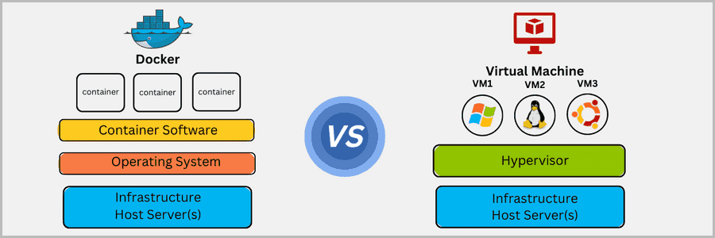
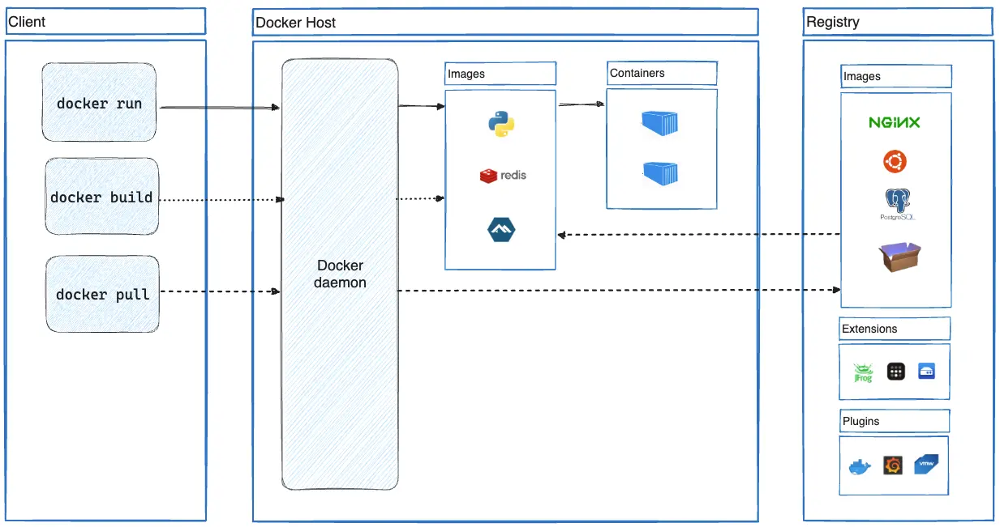
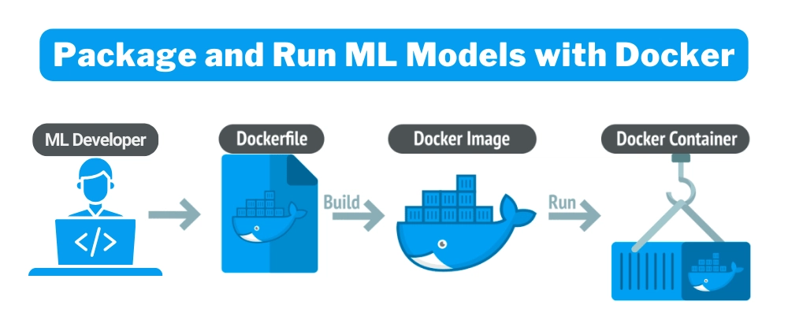

# Lab 05 — Docker Image Building, Containerization & DockerHub

| | |
|---|---|
| 🕘 **Session** | Day 1 · 14:15 – 15:15 (60 min) |
| ☁️ **Where** | EC2 server `devsecops-main` (+ DockerHub in the browser) |
| 🎯 **Objective** | Install Docker, write a **Dockerfile** for the workshop app, build an **image**, run it as a **container**, and **push** it to DockerHub |
| 🏁 **You will have** | The app running in a container at `http://<MAIN_SERVER_IP>:8081` and the image `<YOUR_DOCKERHUB_USERNAME>/workshop-app:1.0` on DockerHub |

---

## 📋 Before you start

| Requirement | Check (☁️ EC2) | Expected |
|---|---|---|
| App jar built (Lab 04) | `ls -lh ~/workshop-app/target/workshop-app.jar` | file exists (~2x MB) |
| Port 8081 free | `sudo ss -tulpn \| grep 8081` | **no output** (else: `pkill -f workshop-app.jar`) |
| DockerHub token | `workshop-secrets.txt` has `dckr_pat_...` | ✔ |

---

## 📚 Concept

### The problem: "It works on my machine!"

In Lab 04 you had to install the **right** Java version before the app would run. Now imagine 50 servers, each
with slightly different Java versions, OS patches and settings. Something always breaks.

**Docker** packages the app **together with its runtime** (Java, OS libraries, config) into one portable unit — an
**image**. If the image runs on your laptop, it runs the same way on any server with Docker.

> 🍱 **Analogy:** a shipping **container** — the crane doesn't care if it holds bananas or laptops; the
> container has a standard size and fits every ship, train and truck. Docker containers fit every server.

### Container vs Virtual Machine


<sub>Source: reference repo vickydevo/DevSecOps-WS</sub>

| | **Virtual Machine** | **Container** |
|---|---|---|
| Includes | A full operating system + kernel | Only the app + its libraries; **shares** the host's kernel |
| Size | GBs | MBs |
| Start time | Minutes | Seconds |
| Isolation | Strong (separate kernel) | Process-level (namespaces, cgroups) |
| Example | Your EC2 instance itself | `workshop-app` running in Docker |

### Docker vocabulary

| Term | Meaning | Analogy |
|---|---|---|
| **Dockerfile** | Text file with step-by-step instructions to build an image | Recipe |
| **Image** | Read-only package built from a Dockerfile (app + runtime) | A frozen, ready-to-cook meal |
| **Container** | A **running** instance of an image | The meal being served — you can serve many from one recipe |
| **Registry** | A server that stores images (DockerHub, AWS ECR…) | Supermarket shelf |
| **Tag** | Version label of an image, e.g. `1.0`, `latest` | Batch number |
| **Layer** | Each Dockerfile instruction creates a cached layer | Stacked transparent sheets |

### Docker architecture


<sub>Source: Docker documentation — docs.docker.com, “What is Docker?” (Apache-2.0)</sub>

### Container lifecycle


<sub>Source: reference repo vickydevo/DevSecOps-WS — the same flow applies to any application, including workshop-app</sub>

---

## 🧾 Syntax reference

| Command | Syntax | What it does |
|---|---|---|
| build | `docker build -t <name>:<tag> .` | Build an image from the `Dockerfile` in the current folder (`.` = build context) |
| images | `docker images` | List local images |
| run | `docker run -d --name <c> -p <hostPort>:<containerPort> <image>` | Start a container (`-d` background, `-p` publish port) |
| ps | `docker ps` · `docker ps -a` | Running containers · all containers incl. stopped |
| logs | `docker logs -f <c>` | Show (follow) container output |
| exec | `docker exec -it <c> sh` | Open a shell **inside** a running container |
| stop / start | `docker stop <c>` · `docker start <c>` | Stop / restart a container |
| rm | `docker rm <c>` · `docker rm -f <c>` | Delete a container (`-f` = even if running) |
| rmi | `docker rmi <image>` | Delete an image |
| tag | `docker tag <src> <user>/<repo>:<tag>` | Give an image another name (needed before push) |
| login / logout | `docker login -u <user>` · `docker logout` | Authenticate to DockerHub |
| push / pull | `docker push <user>/<repo>:<tag>` · `docker pull ...` | Upload / download an image |
| inspect | `docker inspect <c or image>` | Full details in JSON |

---

## 🛠️ Lab

### Part A — Install Docker Engine (official repository) ☁️ EC2

We use Docker's **official** apt repository (as recommended in the Docker documentation) so you get the current
version. Copy **one block at a time**.

**A1.** Install prerequisites:

```bash
sudo apt update
```

```bash
sudo apt install -y ca-certificates curl
```

**A2.** Create a folder for repository signing keys and download Docker's official GPG key:

```bash
sudo install -m 0755 -d /etc/apt/keyrings
```

```bash
sudo curl -fsSL https://download.docker.com/linux/ubuntu/gpg -o /etc/apt/keyrings/docker.asc
```

```bash
sudo chmod a+r /etc/apt/keyrings/docker.asc
```

> 🛡️ The **GPG key** lets `apt` verify that packages really come from Docker and were not tampered with —
> a basic **supply-chain security** control.

**A3.** Add Docker's repository to apt's sources (copy the **whole block**, from `sudo tee` to the final `EOF`):

```bash
sudo tee /etc/apt/sources.list.d/docker.sources <<EOF
Types: deb
URIs: https://download.docker.com/linux/ubuntu
Suites: $(. /etc/os-release && echo "${UBUNTU_CODENAME:-$VERSION_CODENAME}")
Components: stable
Architectures: $(dpkg --print-architecture)
Signed-By: /etc/apt/keyrings/docker.asc
EOF
```

✅ **Expected:** the terminal prints the file contents back, with `Suites: noble` and `Architectures: amd64`.

**A4.** Install Docker:

```bash
sudo apt update
```

```bash
sudo apt install -y docker-ce docker-ce-cli containerd.io docker-buildx-plugin docker-compose-plugin
```

**A5.** Allow the `ubuntu` user to run Docker without `sudo` (adds you to the `docker` group):

```bash
sudo usermod -aG docker $USER
```

**A6.** Group changes apply to **new** logins. Start a new shell with the group active:

```bash
newgrp docker
```

✅ **Check 1:**

```bash
docker version
```

Both a **Client** and a **Server** section must appear (no "permission denied").

✅ **Check 2:**

```bash
docker run hello-world
```

```text
Hello from Docker!
This message shows that your installation appears to be working correctly.
```

> 🛡️ **Security note:** members of the `docker` group effectively have **root** power on the host (they can
> start a container that mounts `/`). Only trusted users — and tomorrow, the Jenkins service — should be in it.

---

### Part B — Write the Dockerfile ☁️ EC2

**B1.** Go to the project:

```bash
cd ~/workshop-app
```

**B2.** Create the file:

```bash
nano Dockerfile
```

**B3.** Type or paste exactly this content:

```dockerfile
# 1. Base image: an official Java 21 runtime (JRE) on Ubuntu
FROM eclipse-temurin:21-jre

# 2. All following commands run inside /app in the image
WORKDIR /app

# 3. Copy the jar we built with Maven into the image
COPY target/workshop-app.jar app.jar

# 4. Document that the app listens on 8081
EXPOSE 8081

# 5. Command that runs when a container starts
ENTRYPOINT ["java", "-jar", "app.jar"]
```

Save: **Ctrl + O** → Enter → **Ctrl + X**.

**B4.** Confirm:

```bash
cat Dockerfile
```

| Instruction | Meaning |
|---|---|
| `FROM` | Start from an existing image. Always the first instruction |
| `WORKDIR` | Set (and create) the working folder inside the image |
| `COPY <src> <dest>` | Copy files from the **build context** (your project folder) into the image |
| `RUN <cmd>` | Run a command **while building** (e.g. install a package). Not used here |
| `ENV KEY=value` | Set an environment variable |
| `EXPOSE` | Documents the port — it does **not** open it; `docker run -p` does |
| `USER` | Which user the container runs as (default: **root** ⚠️ — Lab 06!) |
| `ENTRYPOINT` / `CMD` | What runs when the container starts. `CMD` is easily overridden; `ENTRYPOINT` is the main command |

> 💡 **JRE vs JDK:** the **JDK** contains compilers and tools for *building* Java; the **JRE** only *runs* Java.
> We already built the jar with Maven, so the smaller **JRE** image is enough — less software = smaller attack surface.

---

### Part C — Build the image ☁️ EC2

**C1.** Build and name it `workshop-app` with tag `1.0` (note the **dot** at the end!):

```bash
docker build -t workshop-app:1.0 .
```

| Part | Meaning |
|---|---|
| `-t workshop-app:1.0` | **t**ag: `name:version` |
| `.` | **build context** = current folder. Docker sends it to the daemon; `COPY` can only see files in here |

✅ **Expected (ends with):**

```text
 => [2/3] WORKDIR /app
 => [3/3] COPY target/workshop-app.jar app.jar
 => exporting to image
 => => naming to docker.io/library/workshop-app:1.0
```

**C2.** List images:

```bash
docker images
```

```text
REPOSITORY      TAG       IMAGE ID       CREATED          SIZE
workshop-app    1.0       a1b2c3d4e5f6   10 seconds ago   3xxMB
hello-world     latest    ...            ...              ~10kB
```

**C3.** (Understanding) See the layers your Dockerfile created:

```bash
docker history workshop-app:1.0
```

---

### Part D — Run the container ☁️ EC2

**D1.** Start it:

```bash
docker run -d --name workshop-app -p 8081:8081 workshop-app:1.0
```

| Flag | Meaning |
|---|---|
| `-d` | **d**etached — run in the background |
| `--name workshop-app` | a friendly name (otherwise Docker invents one like `jolly_turing`) |
| `-p 8081:8081` | **p**ublish: `hostPort:containerPort` — traffic to EC2's port 8081 goes into the container's port 8081 |

✅ Docker prints a long container ID.

**D2.** Is it running?

```bash
docker ps
```

```text
CONTAINER ID   IMAGE              COMMAND               STATUS         PORTS                    NAMES
3f2a...        workshop-app:1.0   "java -jar app.jar"   Up 5 seconds   0.0.0.0:8081->8081/tcp   workshop-app
```

**D3.** Watch the logs until `Started WorkshopApplication`, then **Ctrl + C**:

```bash
docker logs -f workshop-app
```

**D4. 🌐 Browser:** `http://<MAIN_SERVER_IP>:8081` → the same portal, now served from a **container**. 🎉

**D5.** Look inside the running container:

```bash
docker exec -it workshop-app sh
```

Inside (prompt changes to `#`):

```bash
whoami
```

```text
root
```

```bash
ls -l /app
```

```bash
exit
```

> 🚨 The app inside the container runs as **root**. If an attacker exploits the app (e.g., the SQL injection you
> saw), they get **root inside the container**. In Lab 06 you will fix this.

**D6.** Practise the lifecycle:

```bash
docker stop workshop-app
```

```bash
docker ps -a
```
→ STATUS `Exited (143)`

```bash
docker start workshop-app
```

```bash
docker ps
```
→ `Up` again.

---

### Part E — Push the image to DockerHub ☁️ EC2 + 🌐

**E1.** Log in. When asked for **Password**, paste your **access token** (`dckr_pat_...`) — nothing appears while pasting:

```bash
docker login -u <YOUR_DOCKERHUB_USERNAME>
```

✅ **Expected:**

```text
WARNING! Your credentials are stored unencrypted in '/home/ubuntu/.docker/config.json'.
...
Login Succeeded
```

> 🛡️ Read that warning! Your token is saved (base64, **not** encrypted) on this server. That's acceptable on your
> own lab VM, but on shared machines run `docker logout` when done (Day 1 checklist).

**E2.** Images must be named `<your-username>/<repository>:<tag>` to be pushed to your account. Add that name:

```bash
docker tag workshop-app:1.0 <YOUR_DOCKERHUB_USERNAME>/workshop-app:1.0
```

```bash
docker images | grep workshop-app
```

```text
<YOUR_DOCKERHUB_USERNAME>/workshop-app   1.0   a1b2c3d4e5f6   ...
workshop-app                             1.0   a1b2c3d4e5f6   ...
```

> 💡 Same **IMAGE ID** — `docker tag` doesn't copy anything, it just adds a second name.

**E3.** Push:

```bash
docker push <YOUR_DOCKERHUB_USERNAME>/workshop-app:1.0
```

✅ **Expected:**

```text
The push refers to repository [docker.io/<YOUR_DOCKERHUB_USERNAME>/workshop-app]
...
1.0: digest: sha256:... size: ...
```

**E4. 🌐** Open **https://hub.docker.com** → **Repositories** → `workshop-app` → tag **1.0** is there.

**E5.** (Proof it works anywhere) delete the local tagged copy and download it back:

```bash
docker rmi <YOUR_DOCKERHUB_USERNAME>/workshop-app:1.0
```

```bash
docker pull <YOUR_DOCKERHUB_USERNAME>/workshop-app:1.0
```

✅ `Status: Downloaded newer image for ...` (or *Image is up to date*).

> 💡 Any server in the world with Docker can now run your app with one `docker run` command.
> **That** is why scanning images *before* pushing them matters — Lab 06.

---

## 🛡️ Security angle

| Topic | Risk | Best practice (you'll apply some in Lab 06) |
|---|---|---|
| Base image | Old/large base images contain **known vulnerabilities** | Use official, minimal, regularly updated images |
| Running as root | Exploit = root inside the container | Create and switch to a non-root `USER` |
| Secrets in images | `ENV PASSWORD=...` is readable by anyone who pulls the image | Inject secrets at runtime; never bake them in |
| `latest` tag | You don't know which version is running | Use explicit version tags (`1.0`, `2.0`, build number) |
| Credentials on disk | `~/.docker/config.json` stores your token | `docker logout` on shared machines; use short-lived tokens |
| `docker` group | Equivalent to root on the host | Only add trusted users/services |

---

## ❌ Common errors

| You see | Why | Fix |
|---|---|---|
| `permission denied while trying to connect to the Docker daemon socket` | Group change not active yet | Run `newgrp docker`, or `exit` and SSH in again |
| `COPY failed: ... target/workshop-app.jar: not found` | Jar not built, or you're not in `~/workshop-app` | `cd ~/workshop-app`; `mvn clean package` |
| `failed to read dockerfile: open Dockerfile: no such file` | Wrong folder or file named `dockerfile.txt` | `ls` — file must be named exactly `Dockerfile` |
| `"docker build" requires exactly 1 argument` | Forgot the `.` at the end | `docker build -t workshop-app:1.0 .` |
| `Bind for 0.0.0.0:8081 failed: port is already allocated` | Something already uses 8081 (old `java -jar` or another container) | `pkill -f workshop-app.jar` · `docker ps` → `docker rm -f <name>` |
| `Conflict. The container name "/workshop-app" is already in use` | A container with that name exists (maybe stopped) | `docker rm -f workshop-app`, then run again |
| `denied: requested access to the resource is denied` (push) | Image not tagged with **your** username, or not logged in | Redo E1 and E2; username must be **lowercase** |
| `unauthorized: incorrect username or password` | Token copied wrong / expired | Generate a new token (Prerequisite 03) |
| `no space left on device` | Disk full | `docker system df`; `docker image prune` |
| Container exits immediately (`docker ps` empty) | App crashed | `docker logs workshop-app` and read the error |

---

## 🏋️ Practice tasks

1. Run a **second** copy of the app on host port 8082: `docker run -d --name app2 -p 8082:8081 workshop-app:1.0`.
   Why can't you open it in the browser? (Hint: security group.) Then remove it: `docker rm -f app2`.
2. Use `docker inspect workshop-app | grep -i '"User"'` — what value do you see and what does it mean?
3. Build tag `1.1` after changing nothing. Does Docker rebuild every layer? Why not? (Hint: **CACHED**.)

---

## 🎤 Interview questions

<details>
<summary><b>1. Image vs container?</b></summary>

An image is a read-only template (layers of files + metadata). A container is a running (or stopped) instance
of an image with its own writable layer and process.
</details>

<details>
<summary><b>2. What does <code>EXPOSE</code> do?</b></summary>

It only **documents** which port the application listens on. Publishing the port to the host is done at run
time with `-p hostPort:containerPort`.
</details>

<details>
<summary><b>3. CMD vs ENTRYPOINT?</b></summary>

`ENTRYPOINT` defines the main executable; `CMD` provides default arguments (or a default command) that are
easily overridden by arguments to `docker run`.
</details>

<details>
<summary><b>4. Why are containers lighter than VMs?</b></summary>

They share the host OS kernel and package only the app and its user-space libraries, instead of a full guest
OS with its own kernel.
</details>

<details>
<summary><b>5. Why is it risky to add a user to the <code>docker</code> group?</b></summary>

The Docker daemon runs as root; anyone who can talk to it can start a privileged container or mount the host
filesystem — effectively root access to the host.
</details>

---

➡️ **Next lab:** [06 — Container Security Scanning using Trivy](06-Container-Security-Scanning-Trivy.md)
