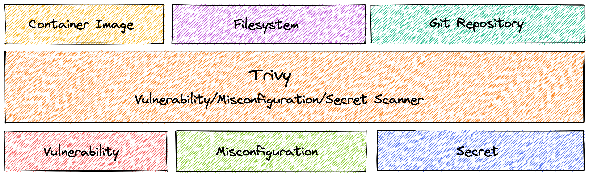
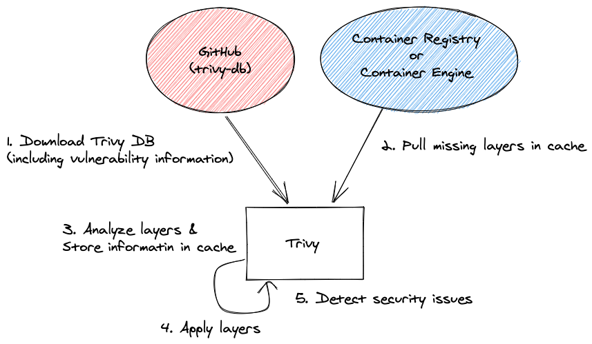
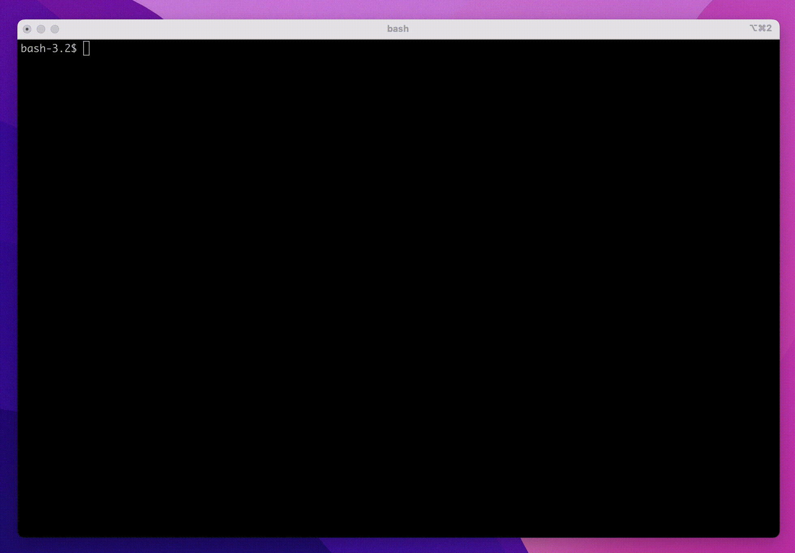

# Lab 06 — Container Security Scanning using Trivy

| | |
|---|---|
| 🕘 **Session** | Day 1 · 15:15 – 16:30 (75 min) |
| ☁️ **Where** | EC2 server `devsecops-main` |
| 🎯 **Objective** | Install **Trivy**, scan Docker images for **vulnerabilities**, **misconfigurations** and **secrets**, compare a *bad* and a *good* image, **harden** your Dockerfile, rescan, and use Trivy as a **security gate** |
| 🏁 **You will have** | A hardened `Dockerfile` pushed to your GitHub fork, image `workshop-app:2.0` running as a **non-root** user, and a before/after comparison of scan results |

---

## 📋 Before you start

| Requirement | Check (☁️ EC2) | Expected |
|---|---|---|
| In the project folder | `cd ~/workshop-app && ls Dockerfile Dockerfile-bad` | both files listed |
| Image from Lab 05 | `docker images workshop-app` | tag `1.0` |
| Jar exists | `ls target/workshop-app.jar` | ✔ |

---

## 📚 Concept

### Vulnerability, CVE, CVSS

| Term | Meaning | Example |
|---|---|---|
| **Vulnerability** | A weakness that can be exploited | A library that runs attacker-supplied code |
| **CVE** | *Common Vulnerabilities and Exposures* — a public ID for a known vulnerability | `CVE-2021-44228` (Log4Shell) |
| **CVSS** | Severity score 0.0 – 10.0 | Log4Shell = **10.0** |
| **Fixed version** | The first version of the package in which the vulnerability is fixed | upgrade `1.9` → `1.10.0` |

| CVSS score | Severity | Typical policy |
|---|---|---|
| 9.0 – 10.0 | 🔴 **CRITICAL** | Block release, fix immediately |
| 7.0 – 8.9 | 🟠 **HIGH** | Fix quickly (days) |
| 4.0 – 6.9 | 🟡 **MEDIUM** | Plan a fix |
| 0.1 – 3.9 | 🟢 **LOW** | Fix when convenient |

### Where vulnerabilities hide inside an image


<sub>Source: Trivy documentation — aquasecurity/trivy (Apache-2.0)</sub>


<sub>Source: Trivy documentation — aquasecurity/trivy (Apache-2.0)</sub>

You wrote **none** of layers 1–3 — but **you** are responsible for shipping them.

### What is Trivy?

**Trivy** (by Aqua Security, open source) is an all-in-one security scanner.

| Scanner | Finds | Command |
|---|---|---|
| **vuln** | Known CVEs in OS packages and language libraries | `trivy image <image>` |
| **misconfig** | Insecure settings in Dockerfiles, Kubernetes, Terraform… | `trivy config <path>` |
| **secret** | Hard-coded passwords, API keys, tokens | `trivy fs --scanners secret <path>` |

**How it works:** Trivy reads the list of packages + versions inside the image and compares them with its
**vulnerability database** (downloaded and refreshed automatically, built from NVD, OS vendor advisories,
GitHub advisories, etc.).

---

## 🧾 Syntax reference

| Command / flag | What it does |
|---|---|
| `trivy image <image>` | Scan a local or remote image (vulnerabilities + secrets) |
| `trivy config <path>` | Scan Dockerfiles / IaC for misconfigurations |
| `trivy fs <path>` | Scan a project folder (dependencies, secrets, misconfig) |
| `--severity HIGH,CRITICAL` | Show only these severities |
| `--ignore-unfixed` | Hide vulnerabilities that have **no fix available yet** |
| `--scanners vuln,secret,misconfig` | Choose which scanners run |
| `--image-config-scanners secret` | Also check image **metadata** (e.g. `ENV`) for secrets |
| `-q` / `--quiet` | Hide progress logs |
| `--format table\|json` · `-o <file>` | Output format · write to a file |
| `--exit-code 1` | Return exit code **1** if findings exist → **fails a pipeline** (security gate) |

---

## 🛠️ Lab

### Part A — Install Trivy (official repository) ☁️ EC2

**A1.** Tools needed to add the repository:

```bash
sudo apt-get install -y wget gnupg
```

**A2.** Download Aqua Security's signing key:

```bash
wget -qO - https://aquasecurity.github.io/trivy-repo/deb/public.key | gpg --dearmor | sudo tee /usr/share/keyrings/trivy.gpg > /dev/null
```

**A3.** Add the Trivy repository:

```bash
echo "deb [signed-by=/usr/share/keyrings/trivy.gpg] https://aquasecurity.github.io/trivy-repo/deb generic main" | sudo tee -a /etc/apt/sources.list.d/trivy.list
```

**A4.** Install:

```bash
sudo apt-get update
```

```bash
sudo apt-get install -y trivy
```

✅ **Check:**

```bash
trivy --version
```

```text
Version: 0.xx.x
```

---

### Part B — First scan: your Lab 05 image ☁️ EC2

```bash
cd ~/workshop-app
```

**B1.** Scan the image you built in Lab 05:

```bash
trivy image workshop-app:1.0
```

> ⏳ The **first** scan downloads Trivy's vulnerability database and, because the image contains a Java jar,
> its **Java index database** too (1–3 minutes in total). Later scans take seconds.

**B2.** Read the report. It has **one section per "target"**:

```text
workshop-app:1.0 (ubuntu 24.04)          ← 1️⃣ OS packages from the base image
Total: NN (UNKNOWN: 0, LOW: NN, MEDIUM: NN, HIGH: N, CRITICAL: 0)

┌────────────┬────────────────┬──────────┬──────────┬───────────────────┬───────────────┬──────────────────┐
│  Library   │ Vulnerability  │ Severity │  Status  │ Installed Version │ Fixed Version │      Title       │
├────────────┼────────────────┼──────────┼──────────┼───────────────────┼───────────────┼──────────────────┤
│ ...        │ CVE-....       │ MEDIUM   │ affected │ ...               │               │ ...              │

Java (jar)                               ← 3️⃣ libraries inside workshop-app.jar
Total: N (... CRITICAL: 1)
│ org.apache.commons:commons-text │ CVE-2022-42889 │ CRITICAL │ fixed │ 1.9 │ 1.10.0 │ ... variable interpolation RCE │
```

| Column | Meaning |
|---|---|
| **Library** | The vulnerable package |
| **Vulnerability** | CVE ID — search it online to learn more |
| **Severity** | LOW → CRITICAL |
| **Status** | `fixed` = a fixed version exists · `affected` / `will_not_fix` = no fix yet |
| **Installed / Fixed Version** | What you have / what you need |

> 🔎 Your exact numbers will differ (the database is updated daily). **Focus on the pattern**, not the numbers.


<sub>Source: reference repo vickydevo/DevSecOps-WS (Trivy-Image-scan/InstallTrivy.md)</sub>


**B3.** Show only what matters most:

```bash
trivy image --severity HIGH,CRITICAL workshop-app:1.0
```

**B4.** Show only the **summary lines** (handy for comparing images):

```bash
trivy image -q --severity HIGH,CRITICAL workshop-app:1.0 | grep Total
```

✅ **Expected:** a CRITICAL finding **`CVE-2022-42889`** in `commons-text` **1.9** — known as **"Text4Shell"**.
It comes from the app's `pom.xml` (Lab 04), not from Docker.

> 💡 **Lesson #1:** a perfectly written Dockerfile cannot fix a vulnerable **library** — that's fixed in the
> **code's dependencies** (Day 2, Lab 05: SCA).

---

### Part C — Meet the "bad" Dockerfile ☁️ EC2

The repository contains a deliberately insecure Dockerfile — the kind you'll find in real projects.

**C1.** Read it:

```bash
cat Dockerfile-bad
```

Spot the problems:

| Line | Problem | Why it's dangerous |
|---|---|---|
| `FROM eclipse-temurin:21.0.1_12-jdk-jammy` | **Old** base image (2023) + full **JDK** | Hundreds of unpatched CVEs; compilers/tools an attacker can use |
| `ENV AWS_ACCESS_KEY_ID=...` / `AWS_SECRET_ACCESS_KEY=...` | **Secrets baked into the image** | Anyone who pulls the image can read them with `docker inspect` |
| `apt-get install ... curl wget vim netcat-openbsd` | Extra tools | Bigger attack surface — attackers love `curl` and `netcat` |
| `chmod 777 app.jar` | Everyone can modify the app | Tampering |
| *(no `USER`)* | Runs as **root** | Exploit = root in the container |
| *(no `HEALTHCHECK`)* | Docker can't tell if the app is healthy | Availability |

**C2.** Build it with tag `bad` (`-f` chooses a Dockerfile with a different name):

```bash
docker build -f Dockerfile-bad -t workshop-app:bad .
```

> ⏳ 2–4 minutes (it downloads an old, large base image and installs packages).

**C3.** Compare **sizes**:

```bash
docker images workshop-app
```

**C4.** Scan it — summary only:

```bash
trivy image -q --severity HIGH,CRITICAL workshop-app:bad | grep Total
```

✅ **Expected:** **far more** HIGH/CRITICAL findings than `1.0`.

**C5.** How many of those can actually be fixed by updating?

```bash
trivy image -q --severity HIGH,CRITICAL --ignore-unfixed workshop-app:bad | grep Total
```

> 💡 `--ignore-unfixed` helps teams focus on what they can act on **today**. The unfixed ones are still a risk — you
> track them and choose a better base image.

**C6.** Find the secrets hidden in the image **metadata**:

```bash
trivy image -q --scanners secret --image-config-scanners secret workshop-app:bad
```

✅ **Expected:** findings such as **AWS Access Key ID** / **AWS Secret Access Key** in the image config (`ENV`).

Prove that *anyone* with the image can read them:

```bash
docker inspect workshop-app:bad --format '{{json .Config.Env}}'
```

---

### Part D — Scan for misconfigurations and secrets in the code ☁️ EC2

**D1.** Misconfiguration scan of the **bad** Dockerfile:

```bash
trivy config Dockerfile-bad
```

**D2.** …and of **your** Lab 05 Dockerfile:

```bash
trivy config Dockerfile
```

✅ **Expected:** even your Dockerfile gets findings like:

```text
HIGH: Specify at least 1 USER command in Dockerfile with non-root user as argument
LOW:  Add HEALTHCHECK instruction in your Dockerfile
```

**D3.** Secret scan of the whole **project folder** (source code, config files):

```bash
trivy fs -q --scanners secret .
```

✅ **Expected:** AWS credentials found in **`src/main/resources/application.properties`** (and `Dockerfile-bad`).

> 🔐 That's the same thing you noticed in Lab 04. Don't fix it yet — on Day 2 you'll handle it properly with
> **Gitleaks**, including the Git **history**.



<sub>Source: Trivy documentation — aquasecurity/trivy (Apache-2.0)</sub>


---

### Part E — Harden your Dockerfile ☁️ EC2

Now apply what the scanner taught you.

**E1.** Open your Dockerfile:

```bash
nano Dockerfile
```

**E2.** Delete everything (**Ctrl + K** removes one line at a time) and paste this **hardened** version:

```dockerfile
# ---- Hardened Dockerfile for workshop-app ----

# 1. Small, maintained base image: Java 21 *runtime only* (JRE) on Alpine Linux
FROM eclipse-temurin:21-jre-alpine

# 2. Create an unprivileged system user and group called "app"
RUN addgroup -S app && adduser -S -G app app

WORKDIR /app

# 3. Copy the jar and make "app" its owner (no chmod 777!)
COPY --chown=app:app target/workshop-app.jar app.jar

# 4. Drop root privileges — everything below runs as "app"
USER app

EXPOSE 8081

# 5. Let Docker check that the application is really healthy
HEALTHCHECK --interval=30s --timeout=5s --start-period=40s --retries=3 \
  CMD wget -qO- http://localhost:8081/actuator/health || exit 1

ENTRYPOINT ["java", "-jar", "app.jar"]
```

Save: **Ctrl + O** → Enter → **Ctrl + X**.

| Change | Fixes |
|---|---|
| `21-jre-alpine` | Fewer OS packages → far fewer CVEs; much smaller image |
| `addgroup` / `adduser` + `USER app` | No longer runs as **root** |
| `COPY --chown=app:app` | Correct ownership without dangerous `chmod 777` |
| `HEALTHCHECK` | Docker reports `healthy` / `unhealthy` |
| No `ENV` secrets, no extra tools | Nothing to leak, less to attack |

**E3.** Misconfiguration re-check:

```bash
trivy config Dockerfile
```

✅ **Expected:** the **USER** and **HEALTHCHECK** findings are gone.

**E4.** Build version `2.0`:

```bash
docker build -t workshop-app:2.0 .
```

**E5.** Compare all three images:

```bash
docker images workshop-app
```

```bash
trivy image -q --severity HIGH,CRITICAL workshop-app:2.0 | grep Total
```

**E6.** Fill in this table with **your** results (from C3/C4, B4 and E5):

| Image | Size | HIGH | CRITICAL | Runs as |
|---|---|---|---|---|
| `workshop-app:bad` | | | | root |
| `workshop-app:1.0` | | | | root |
| `workshop-app:2.0` | | | | app |

> ✅ **Expected pattern:** `bad` ≫ `1.0` > `2.0` for OS findings. The **commons-text CRITICAL** remains in
> **all three** — because it's inside the jar. (Day 2 fixes it.)

**E7.** Prove the container is no longer root:

```bash
docker run --rm --entrypoint whoami workshop-app:2.0
```

```text
app
```

**E8.** Replace the running container with the hardened one:

```bash
docker rm -f workshop-app
```

```bash
docker run -d --name workshop-app -p 8081:8081 workshop-app:2.0
```

Wait ~45 seconds, then:

```bash
docker ps
```

```text
... STATUS                    ...  NAMES
... Up 50 seconds (healthy)   ...  workshop-app
```

✅ **🌐** `http://<MAIN_SERVER_IP>:8081` still works — now **non-root** and **health-checked**.

---

### Part F — Trivy as a security gate ☁️ EC2

Pipelines (Jenkins, GitHub Actions…) decide "pass/fail" by a command's **exit code**: `0` = success,
anything else = failure.

**F1.** Default behaviour — findings are only *reported*:

```bash
trivy image -q --severity CRITICAL workshop-app:2.0 > /dev/null; echo "Exit code: $?"
```

```text
Exit code: 0
```

**F2.** Gate mode — fail if any CRITICAL is found:

```bash
trivy image -q --severity CRITICAL --exit-code 1 workshop-app:2.0 > /dev/null; echo "Exit code: $?"
```

```text
Exit code: 1
```

> 🚦 In a pipeline, exit code `1` **stops** the pipeline: the image is never pushed or deployed.
> Tomorrow you'll fix the library and watch this gate turn **green**.

| Part | Meaning |
|---|---|
| `> /dev/null` | Throw away the report (we only care about the exit code here) |
| `$?` | Shell variable holding the exit code of the **last** command |

**F3.** Save a report file (what pipelines archive as evidence):

```bash
trivy image -q --severity HIGH,CRITICAL -o trivy-report.txt workshop-app:2.0
```

```bash
head -20 trivy-report.txt
```

---

### Part G — Save your work: push the hardened Dockerfile to GitHub ☁️ EC2

Tomorrow's Jenkins pipeline builds from **your GitHub fork**, so your hardened Dockerfile must be there.

**G1.** Let Git remember your token for 10 hours (so you don't paste it repeatedly):

```bash
git config --global credential.helper 'cache --timeout=36000'
```

**G2.** See what changed:

```bash
git status
```

You'll see `Dockerfile` as a new, untracked file. (`app.log` and `trivy-report.txt` don't appear — the project's
`.gitignore` excludes logs and scan reports.) We commit **only** the Dockerfile:

```bash
git add Dockerfile
```

```bash
git commit -m "Add hardened Dockerfile (non-root, alpine JRE, healthcheck)"
```

**G3.** Push. Username = your GitHub username · Password = your **PAT** (`ghp_...`):

```bash
git push
```

✅ **Check 🌐:** `https://github.com/<YOUR_GITHUB_USERNAME>/workshop-app` shows `Dockerfile` with your commit message.

**G4.** Push the hardened image to DockerHub too:

```bash
docker tag workshop-app:2.0 <YOUR_DOCKERHUB_USERNAME>/workshop-app:2.0
```

```bash
docker push <YOUR_DOCKERHUB_USERNAME>/workshop-app:2.0
```

---

## 🛡️ Security angle — Docker image best practices (checklist)

| ✅ Practice | Status in `2.0` |
|---|---|
| Minimal, official, **recent** base image | ✔ `eclipse-temurin:21-jre-alpine` |
| Runtime (JRE) instead of build tools (JDK) | ✔ |
| Non-root `USER` | ✔ `app` |
| No secrets in `ENV`, `ARG` or files | ✔ |
| No unnecessary packages (`curl`, `vim`, `netcat`) | ✔ |
| No `chmod 777` | ✔ |
| `HEALTHCHECK` | ✔ |
| Explicit version tags, not `latest` | ✔ `2.0` |
| **Scan every image before pushing/deploying** | ✔ manual today → **automated in Jenkins tomorrow** |
| Vulnerable libraries in the app | ❌ commons-text 1.9 → **Day 2** |

---

## ❌ Common errors

| You see | Why | Fix |
|---|---|---|
| `trivy: command not found` | Install didn't finish | Repeat Part A; check `apt-get install` output for errors |
| `E: The repository ... trivy-repo ... does not have a Release file` | Typo in the `echo "deb ..."` line | `sudo rm /etc/apt/sources.list.d/trivy.list` and redo A3 |
| `FATAL ... failed to download vulnerability DB` / `TOOMANYREQUESTS` | Network issue or DB mirror rate-limited | Wait 1–2 minutes and rerun |
| `unable to find the specified image "workshop-app:2.0"` | Image not built / typo in tag | `docker images workshop-app` |
| `no space left on device` | Old images fill the disk | `docker image prune -f` ; `docker rmi workshop-app:bad` after comparing |
| Container `(unhealthy)` | App not responding on 8081 inside container | `docker logs workshop-app` |
| `adduser: unrecognized option` | You used Ubuntu syntax on Alpine (or Alpine syntax on Ubuntu) | Use the exact Dockerfile above with the `-alpine` base image |
| `remote: Invalid username or token` on `git push` | Used password instead of PAT | Paste the `ghp_...` token as password |
| `Updates were rejected because the remote contains work...` | Fork changed on GitHub | `git pull --rebase` then `git push` |

---

## 🏋️ Practice tasks

1. Scan a famous image: `trivy image -q --severity CRITICAL nginx:1.16` — why would anyone still run it?
2. Export a JSON report and count CRITICAL findings with one line:
   `trivy image -q -f json workshop-app:bad | grep -c '"Severity": "CRITICAL"'`
3. Clean up the bad image when you're done comparing: `docker rmi workshop-app:bad`.

---

## 🎤 Interview questions

<details>
<summary><b>1. What is the difference between a vulnerability scan and a misconfiguration scan?</b></summary>

A vulnerability scan matches installed package versions against databases of known CVEs. A misconfiguration
scan checks configuration files (Dockerfile, Kubernetes YAML, Terraform) against security best-practice rules,
e.g. "container must not run as root".
</details>

<details>
<summary><b>2. Why use an Alpine or "distroless" base image?</b></summary>

Fewer packages → fewer vulnerabilities, smaller size, faster pulls and a smaller attack surface (often no shell or package manager for an attacker to use).
</details>

<details>
<summary><b>3. How does Trivy fail a CI/CD pipeline?</b></summary>

With `--exit-code 1` (usually combined with `--severity`), Trivy returns a non-zero exit code when matching
findings exist; the CI system treats a non-zero exit code as a failed step.
</details>

<details>
<summary><b>4. A scan shows a CRITICAL CVE with status "affected" and no fixed version. What do you do?</b></summary>

Assess exploitability in your context, look for an alternative base image/package, apply mitigations, document
an accepted risk with an expiry date if needed, and monitor until a fix is released.
</details>

<details>
<summary><b>5. Why is <code>ENV AWS_SECRET_ACCESS_KEY=...</code> in a Dockerfile dangerous even if the repo is private?</b></summary>

The value is stored in the image metadata/layers. Anyone who can pull the image (registry users, CI systems,
attackers who breach the registry) can read it with `docker inspect` or `docker history`.
</details>

---

✅ **Finished?** Go to the [Day 1 Completion Checklist](Day-1-Completion-Checklist.md).
