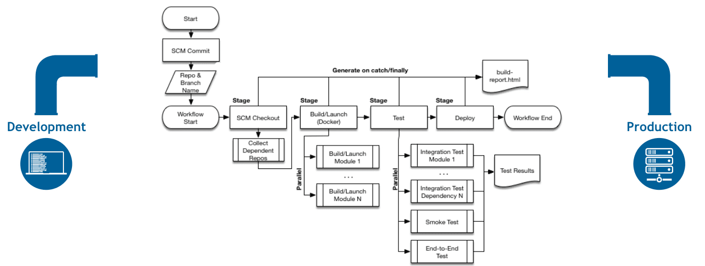
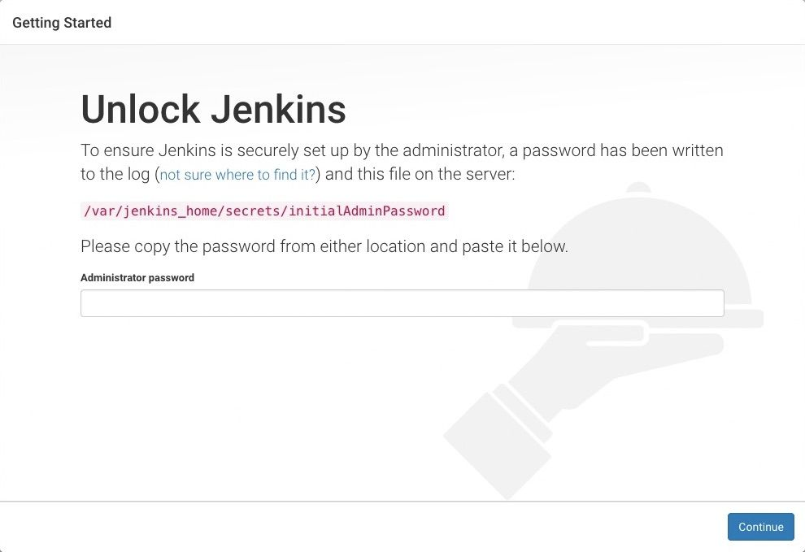
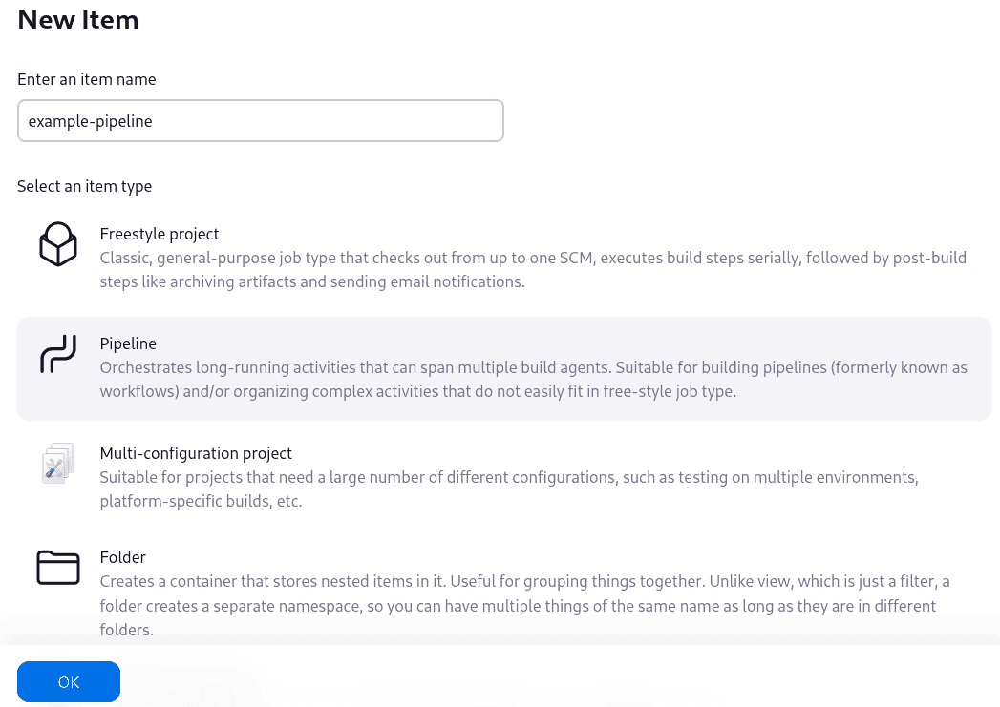
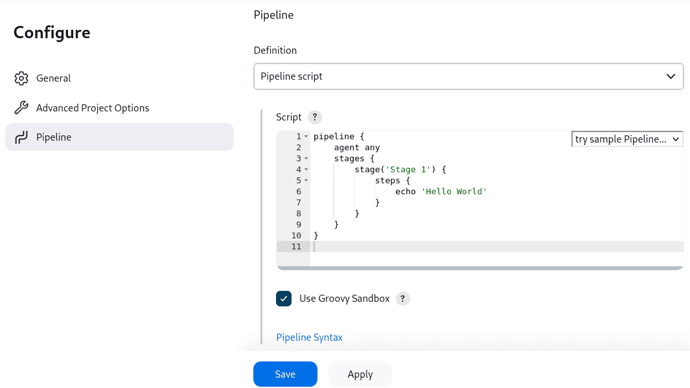
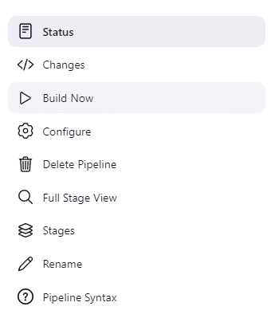
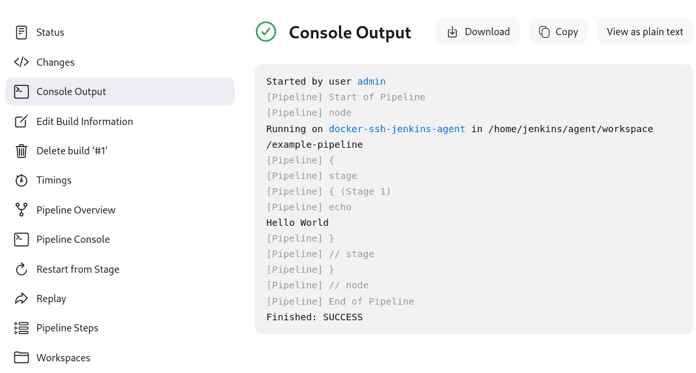
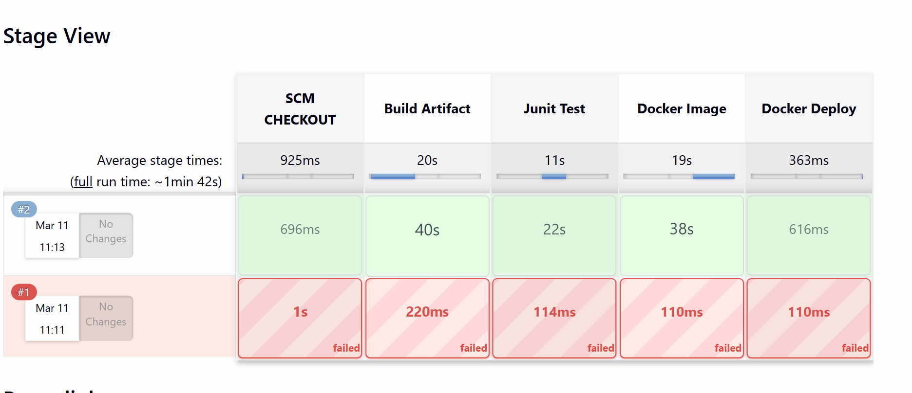

# Lab 01 — Secure CI/CD Pipeline Concepts · Jenkins Setup · Declarative Pipeline Basics

| | |
|---|---|
| 🕘 **Session** | Day 2 · 09:30 – 10:30 (60 min) |
| 🌐☁️ **Where** | AWS Console → `devsecops-main` (MAIN terminal) → Jenkins in the browser |
| 🎯 **Objective** | Understand what makes a CI/CD pipeline **secure**, what a **security gate** is, install **Jenkins**, and write and run your first **declarative pipeline** — including one that **fails on purpose** |
| 🏁 **You will have** | Jenkins running at `http://<MAIN_SERVER_IP>:8080` and a working `hello-pipeline` job |

---

## 📋 Before you start

| Requirement | Check |
|---|---|
| `devsecops-main` exists and is **Stopped** (from Day 1) | 🌐 EC2 → Instances |
| Your fork has the hardened `Dockerfile` | 🌐 `https://github.com/<YOUR_GITHUB_USERNAME>/workshop-app` |
| `devsecops-key.pem` in `~/devsecops` | 💻 `ls ~/devsecops/devsecops-key.pem` |

---

## 🛠️ Part A — Resize and start your server (do this FIRST, while the trainer talks) 🌐 Browser

Jenkins + Maven + Docker + scanners need more than the 1 GB RAM of a `t3.micro`. AWS lets you change the
instance type of a **stopped** instance — your disk (and everything you installed yesterday) stays.

**A1.** EC2 → **Instances** → select **devsecops-main** → confirm **Instance state = Stopped**.
(If it's *Running*: **Instance state → Stop instance**, wait until *Stopped*.)

**A2.** **Actions → Instance settings → Change instance type**.

**A3.** New instance type: **`c7i-flex.large`** → **Change**.

> 💡 `c7i-flex.large` = 2 vCPU, **4 GB RAM** and is Free Tier eligible for new accounts.
> If it's not offered in your account, choose **`t3.medium`** (same CPU/RAM) instead.

**A4.** **Instance state → Start instance**. Wait for **Running** and **3/3 checks passed**.

**A5.** Copy the **new Public IPv4 address** → update `workshop-secrets.txt`. This is your `<MAIN_SERVER_IP>` for today.

**A6. 💻 Laptop** — connect (MAIN terminal):

```bash
cd ~/devsecops
```

```bash
ssh -i devsecops-key.pem ubuntu@<MAIN_SERVER_IP>
```

> ❓ SSH warns `REMOTE HOST IDENTIFICATION HAS CHANGED`? Not with a stop/start of the same instance — but if it
> happens (IP reused from another server), run `ssh-keygen -R <MAIN_SERVER_IP>` on your laptop and connect again.

✅ **Check ☁️ EC2:**

```bash
free -h
```

```text
Mem:   3.7Gi ...
Swap:  2.0Gi ...
```

```bash
nproc
```
→ `2`

```bash
docker images workshop-app
```
→ your `1.0` and `2.0` images from yesterday are still here.

---

## 📚 Part B — Concepts: what makes a pipeline *secure*?

### B1. What is a CI/CD pipeline?

A **pipeline** is an automated sequence of **stages** that takes code from a Git repository to a running
application. Each stage must succeed before the next one starts.


<sub>Source: Jenkins documentation — jenkins.io, Pipeline chapter (CC BY-SA 4.0)</sub>

**Pipeline as code:** the pipeline definition is a text file (`Jenkinsfile`) stored **in the Git repository** with
the application. It is versioned, reviewed in pull requests and reproducible — just like application code.

### B2. A secure CI/CD pipeline has two sides

| Security **in** the pipeline | Security **of** the pipeline |
|---|---|
| The pipeline **checks the application**: SAST, SCA, secrets scanning, image scanning | The pipeline **itself** is protected: credentials, permissions, plugins, logs |
| *"Is the code we ship safe?"* | *"Can an attacker abuse our CI/CD system?"* |
| Labs 03 – 06 | This lab + credential handling in Lab 06 |

### B3. How attackers abuse pipelines (OWASP Top 10 CI/CD Security Risks — selected)

| Risk (OWASP ID) | Example | Control you'll apply |
|---|---|---|
| **Insufficient flow control** (CICD-SEC-1) | Code reaches production without review or checks | **Security gates** that stop the pipeline |
| **Dependency chain abuse** (CICD-SEC-3) | A vulnerable or malicious library gets pulled into the build | **SCA** — Dependency-Check (Lab 05) |
| **Poisoned pipeline execution** (CICD-SEC-4) | Attacker changes the `Jenkinsfile` in a PR to run their own commands | Review pipeline changes; restrict who can trigger builds |
| **Insufficient credential hygiene** (CICD-SEC-6) | Tokens hard-coded in scripts or printed in build logs | **Jenkins Credentials** store, masked secrets (Lab 06) |
| **Insecure system configuration** (CICD-SEC-7) | Jenkins open to the internet with default settings | Admin password, minimal plugins, updates |
| **Improper artifact integrity validation** (CICD-SEC-9) | Deploying an image nobody scanned | **Trivy** gate before deploy |

### B4. Security gates

A **security gate** is a pipeline step with a **pass/fail rule**. If the rule is broken, the step returns a
**non-zero exit code** → the pipeline **stops** → later stages (like Deploy) never run.

| Gate in our pipeline | Tool | Fails when… |
|---|---|---|
| Secrets gate | Gitleaks | Any secret is found in the Git history (not explicitly accepted) |
| Unit-test gate | Maven | Any test fails |
| Code-quality / SAST gate | SonarQube **Quality Gate** | Security or Reliability rating worse than **A** |
| Dependency gate | OWASP Dependency-Check | A library has a vulnerability with **CVSS ≥ 9.0** |
| Image gate | Trivy | The image has a **CRITICAL** vulnerability with a fix available |

```text
[Build] → ◆ Gate: tests pass? ──no──▶ ❌ STOP, notify developer
              │yes
              ▼
          [Scan] → ◆ Gate: no CRITICAL? ──no──▶ ❌ STOP, notify developer
                         │yes
                         ▼
                     🚀 Deploy
```

> 💡 **Fail fast:** put **cheap, quick** checks (secrets, unit tests) **early** and slow ones (full scans) later,
> so developers get feedback in minutes.

---

## 🛠️ Part C — Install Jenkins ☁️ EC2 (MAIN)

**Jenkins** is the most widely used open-source automation server for CI/CD. It runs as a **service** on
`devsecops-main` under its own Linux user, **`jenkins`**, and stores everything in `/var/lib/jenkins`.

**C1.** Java 21 is already installed (Day 1). Jenkins also needs `fontconfig`:

```bash
sudo apt update
```

```bash
sudo apt install -y fontconfig
```

```bash
java -version
```
→ `openjdk version "21..."`

**C2.** Download the Jenkins repository signing key (official instructions):

```bash
sudo wget -O /etc/apt/keyrings/jenkins-keyring.asc https://pkg.jenkins.io/debian-stable/jenkins.io-2026.key
```

**C3.** Add the Jenkins **LTS** (stable) repository:

```bash
echo "deb [signed-by=/etc/apt/keyrings/jenkins-keyring.asc] https://pkg.jenkins.io/debian-stable binary/" | sudo tee /etc/apt/sources.list.d/jenkins.list > /dev/null
```

**C4.** Install Jenkins:

```bash
sudo apt update
```

```bash
sudo apt install -y jenkins
```

**C5.** Check the service:

```bash
sudo systemctl status jenkins --no-pager
```

✅ **Expected:** `Active: active (running)`. If it says `activating (start)`, wait 30 seconds and check again.

```bash
sudo ss -tulpn | grep 8080
```

✅ `java` is listening on `:8080`.

**C6.** Allow Jenkins to use Docker (your pipeline will build images), then restart Jenkins so it picks up the new group:

```bash
sudo usermod -aG docker jenkins
```

```bash
sudo systemctl restart jenkins
```
**Start , disable and Enable Jenkins:
```bash
sudo systemctl status jenkins
sudo systemctl start jenkins
sudo systemctl enable jenkins
sudo systemctl stop jenkins
sudo systemctl disable jenkins
````
> 🛡️ Remember Day 1: the `docker` group ≈ root on this host. We accept that for this single-purpose lab server.
> In production, builds run on separate, disposable **agents**, not on the Jenkins controller.

**C7.** Read the one-time **initial admin password**:

```bash
sudo cat /var/lib/jenkins/secrets/initialAdminPassword
```

Copy the 32-character value.

---

## 🛠️ Part D — First-time setup 🌐 Browser

**D1.** Open `http://<MAIN_SERVER_IP>:8080` → **Unlock Jenkins** → paste the password → **Continue**.



<sub>Source: Jenkins documentation — jenkins.io (CC BY-SA 4.0)</sub>


**D2.** **Customize Jenkins** → **Install suggested plugins**. ⏳ 3–5 minutes.

**D3.** **Create First Admin User:**

| Field | Value |
|---|---|
| Username | `admin` |
| Password | a strong password → save it in `workshop-secrets.txt` |
| Full name | your name |
| E-mail | your email |

→ **Save and Continue**.

**D4.** **Instance Configuration:** keep `http://<MAIN_SERVER_IP>:8080/` → **Save and Finish** → **Start using Jenkins**.

✅ **Check:** the Jenkins dashboard says *"Welcome to Jenkins!"*.

**D5.** (Recommended) Install the stage visualisation plugin:
**Manage Jenkins → Plugins → Available plugins** → search **`Stage View`** → tick **Pipeline: Stage View** →
**Install**. When it finishes, go back to the dashboard.

> 🛡️ **Security of the pipeline:** you just replaced the random unlock password with a named admin account.
> In real setups also: enable HTTPS, restrict port 8080 to the company network, install only needed plugins and
> keep Jenkins + plugins updated (**Manage Jenkins** shows warnings for vulnerable plugins).

---

## 📚 Part E — Declarative pipeline syntax

Jenkins pipelines are written in a **Groovy-based** language. The **declarative** style is structured and
easy to read:

```groovy
pipeline {                                   // 1. Everything lives inside "pipeline"
    agent any                                // 2. WHERE to run: any available Jenkins node

    environment {                            // 3. Variables available to all stages
        APP_NAME = 'workshop-app'
    }

    stages {                                 // 4. The ordered list of stages
        stage('Build') {                     // 5. A named stage (a box in the Stage View)
            steps {                          // 6. The actual commands
                echo "Building ${APP_NAME}"  //    print a message
                sh 'mvn -v'                  //    run a Linux shell command
            }
        }
        stage('Test') {
            steps {
                sh 'echo running tests'
            }
        }
    }

    post {                                   // 7. Runs AFTER all stages, depending on the result
        success { echo 'Pipeline passed' }
        failure { echo 'Pipeline failed' }
        always  { echo 'Runs every time (cleanup, reports)' }
    }
}
```

| Keyword | Required? | Meaning |
|---|---|---|
| `pipeline { }` | ✅ | Root block |
| `agent any` | ✅ | Run on any available executor/node |
| `environment { }` | ❌ | Key–value variables (`$APP_NAME` in `sh`, `${APP_NAME}` in Groovy strings) |
| `options { }` | ❌ | Job options, e.g. `timeout(time: 30, unit: 'MINUTES')` |
| `stages { }` / `stage('Name') { }` | ✅ | Ordered stages |
| `steps { }` | ✅ | Commands inside a stage |
| `post { }` | ❌ | `always`, `success`, `failure`, `unstable`, `cleanup` blocks |

| Common step | Example | Does |
|---|---|---|
| `echo` | `echo 'hi'` | Print to the build log |
| `sh` | `sh 'mvn -B test'` | Run a shell command. **Non-zero exit code → stage fails** |
| `git` | `git branch: 'main', url: 'https://github.com/...'` | Check out a repository |
| `withCredentials` | (Lab 06) | Use a stored secret safely |
| `archiveArtifacts` | `archiveArtifacts artifacts: 'report.html'` | Keep files (reports) with the build |

> 💡 **Built-in variables:** `BUILD_NUMBER` (1, 2, 3…), `JOB_NAME`, `WORKSPACE` (folder where the job runs:
> `/var/lib/jenkins/workspace/<job-name>`).

---

## 🛠️ Part F — Your first pipeline (and a failing gate) 🌐 Browser

**F1.** Dashboard → **New Item** → name: `hello-pipeline` → select **Pipeline** → **OK**.



<sub>Source: Jenkins documentation — jenkins.io (CC BY-SA 4.0) — your item name is **hello-pipeline**</sub>


**F2.** Scroll down to **Pipeline** → Definition: **Pipeline script** → paste:



<sub>Source: Jenkins documentation — jenkins.io (CC BY-SA 4.0) — replace the sample with the script below</sub>


```groovy
pipeline {
    agent any

    environment {
        GREETING = 'Hello DevSecOps'
    }

    stages {
        stage('1. Info') {
            steps {
                echo "${GREETING} - build number ${BUILD_NUMBER}"
                sh 'whoami'
                sh 'java -version'
                sh 'docker ps'
            }
        }
        stage('2. Security Gate (demo)') {
            steps {
                sh 'echo "Pretending to scan..."'
                sh 'exit 0'
            }
        }
        stage('3. Deploy (demo)') {
            steps {
                echo 'Deploying... (only reached if the gate passed)'
            }
        }
    }

    post {
        success { echo 'All stages passed ✅' }
        failure { echo 'Pipeline FAILED ❌ - nothing was deployed' }
        always  { echo 'Post section: archive reports, clean up, notify' }
    }
}
```

→ **Save**.

**F3.** Click **Build Now** (left menu). A build **#1** appears under *Build History*.



<sub>Source: Jenkins documentation — jenkins.io (CC BY-SA 4.0)</sub>


**F4.** Click **#1** → **Console Output**.



<sub>Source: Jenkins documentation — jenkins.io (CC BY-SA 4.0)</sub>


✅ **Expected (excerpt):**

```text
Hello DevSecOps - build number 1
+ whoami
jenkins
+ java -version
openjdk version "21..."
+ docker ps
CONTAINER ID   IMAGE ...
...
Deploying... (only reached if the gate passed)
All stages passed ✅
Finished: SUCCESS
```

> 💡 `whoami` → **`jenkins`**: pipelines run as the `jenkins` user, **not** as `ubuntu`. Files, permissions and
> tools must work for that user — remember this when something works in your terminal but fails in Jenkins.

**F5.** Make the gate **fail**: **Configure** → in stage 2 change `sh 'exit 0'` to **`sh 'exit 1'`** → **Save** → **Build Now**.

✅ **Expected:** build **#2** is **red**. Console Output:

```text
+ exit 1
...
Stage "3. Deploy (demo)" skipped due to earlier failure(s)
Pipeline FAILED ❌ - nothing was deployed
Finished: FAILURE
```

> 🚦 **This is exactly how every security gate works today.** Trivy, Gitleaks, Dependency-Check and the
> SonarQube Quality Gate all signal "fail" with a **non-zero exit code**, and Jenkins refuses to continue.

**F6.** Change it back to `exit 0` → **Save** → **Build Now** → green again.

**F7.** Open the job page — with **Stage View** installed you'll see a coloured table of stages per build.



<sub>Source: reference repo vickydevo/DevSecOps-WS</sub>


---

## 🛡️ Security angle — summary

| ✔ Did today | Why |
|---|---|
| Strong admin password, unlock key replaced | No default/anonymous access |
| Jenkins runs as its own `jenkins` user | Separation from your login user |
| Learned: non-zero exit code = gate fails | Foundation of every security gate |
| ⚠️ Port 8080 open to the internet, Docker access for Jenkins | Acceptable on a short-lived lab server only |

---

## ❌ Common errors

| You see | Why | Fix |
|---|---|---|
| "Change instance type" is greyed out | Instance is not **Stopped** | Stop it first, wait for *Stopped* |
| `c7i-flex.large` not in the list / "not supported" | Not available for your account/AZ | Use **`t3.medium`** |
| SSH `Connection timed out` | Using yesterday's IP | Copy the **new** Public IPv4 from the console |
| `NO_PUBKEY` / `The repository ... is not signed` during `apt update` | Key download (C2) failed or wrong URL | Re-run C2 exactly; then `sudo apt update` |
| Browser can't open `:8080` | Jenkins still starting, or port 8080 not in security group | `sudo systemctl status jenkins`; check SG rule 3 from Day 1 |
| Plugin installation shows some ❌ failures | Temporary download error | Click **Retry**; or continue and install later from *Manage Jenkins → Plugins* |
| Console: `docker: permission denied ... docker.sock` | Jenkins wasn't restarted after `usermod` | `sudo systemctl restart jenkins`, then rebuild |
| Console: `java: not found` / `mvn: not found` | Tools missing on the server | `sudo apt install -y openjdk-21-jdk-headless maven` |
| Forgot the admin password | — | Ask the trainer; reset requires editing Jenkins config (avoid: save it now!) |

---

## 🎤 Interview questions

<details>
<summary><b>1. Declarative vs scripted pipeline?</b></summary>

Declarative pipelines use a fixed, structured syntax (`pipeline { agent … stages … }`) that is easier to read and
validate. Scripted pipelines are plain Groovy (`node { … }`) — more flexible but harder to maintain.
</details>

<details>
<summary><b>2. How does a pipeline "know" that a security scan failed?</b></summary>

By the exit code of the command. A non-zero exit code fails the `sh` step, which fails the stage and stops the
pipeline (unless configured otherwise).
</details>

<details>
<summary><b>3. Name three ways to secure Jenkins itself.</b></summary>

Authentication with strong credentials/SSO and role-based authorization; keep Jenkins and plugins updated and
minimal; store secrets in the Credentials store (never in Jenkinsfiles); run builds on agents rather than the
controller; restrict network access (HTTPS, VPN/firewall).
</details>

<details>
<summary><b>4. What is "Poisoned Pipeline Execution"?</b></summary>

An attack where someone modifies the pipeline definition (e.g. the Jenkinsfile in a pull request) or files it
uses, so the CI system runs the attacker's commands — often to steal the secrets available to the build.
</details>

<details>
<summary><b>5. What is the <code>post</code> section used for?</b></summary>

Actions after the stages finish, based on the result: archiving reports (`always`), notifications (`failure`),
cleanup (`cleanup`), etc.
</details>

---

➡️ **Next lab:** [02 — SAST Theory & SonarQube Setup](02-SAST-Theory-and-SonarQube-Setup.md)
