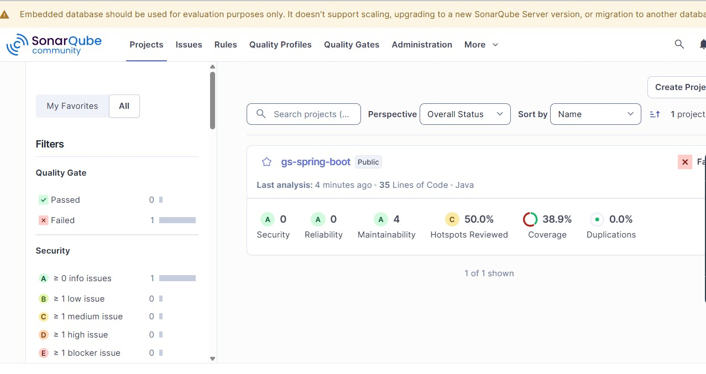

# Lab 03 — SAST Hands-on: Analyse, Gate, Fix & Rescan with SonarQube

| | |
|---|---|
| 🕘 **Session** | Day 2 · 11:45 – 12:30 (45 min) |
| ☁️🌐 **Where** | **MAIN** terminal (`devsecops-main`) + SonarQube in the browser |
| 🎯 **Objective** | Run a SonarQube analysis of `workshop-app`, read the **vulnerabilities, bugs and hotspots**, create a strict **Quality Gate**, watch the build **fail**, **fix the code**, and rescan until the gate **passes** |
| 🏁 **You will have** | Project `workshop-app` in SonarQube with Quality Gate **Passed**, and your fixes pushed to GitHub |

---

## 📋 Before you start

| Requirement | Check | Expected |
|---|---|---|
| SonarQube is UP | ☁️ SONAR: `curl -s localhost:9000/api/system/status` | `"status":"UP"` |
| Token saved | `workshop-secrets.txt` has `squ_...` | ✔ |
| Port 9000 reachable from MAIN | ☁️ MAIN: `curl -s http://<SONAR_SERVER_IP>:9000/api/system/status` | `"status":"UP"` |
| Project folder | ☁️ MAIN: `cd ~/workshop-app && git status` | `On branch main` |

---

## 🛠️ Part A — Run the first analysis ☁️ MAIN

The **SonarScanner for Maven** runs on the build machine: Maven compiles and tests the code, then the scanner
analyses it and uploads the report to the SonarQube server.

**A1.** Go to the project and get the latest version of your fork:

```bash
cd ~/workshop-app
```

```bash
git pull
```

**A2.** Store the server address in a variable (replace the IP):

```bash
export SONAR_HOST_URL=http://<SONAR_SERVER_IP>:9000
```

**A3.** Store the token **without** showing it on screen or saving it in your shell history:

```bash
read -s -p "Paste SonarQube token: " SONAR_TOKEN; echo
```

✅ **Check** (prints only the first 4 characters):

```bash
echo "URL=$SONAR_HOST_URL  TOKEN=${SONAR_TOKEN:0:4}..."
```

```text
URL=http://<SONAR_SERVER_IP>:9000  TOKEN=squ_...
```

**A4.** Run build + tests + analysis:

```bash
mvn -B clean verify sonar:sonar -Dsonar.projectKey=workshop-app -Dsonar.projectName=workshop-app -Dsonar.host.url=$SONAR_HOST_URL -Dsonar.token=$SONAR_TOKEN
```

| Part | Meaning |
|---|---|
| `-B` | **B**atch mode — cleaner logs (no download progress bars) |
| `clean verify` | Compile, run tests, create the **JaCoCo** coverage report (needed for coverage in SonarQube) |
| `sonar:sonar` | Run the SonarQube scanner goal |
| `-Dsonar.projectKey` | Unique ID of the project in SonarQube (created automatically on first analysis) |
| `-Dsonar.host.url` · `-Dsonar.token` | Where to send results · how to authenticate |

> ⏳ 2–4 minutes (first run downloads the scanner and the Java analyzer).

✅ **Expected (end of output):**

```text
[INFO] ANALYSIS SUCCESSFUL, you can find the results at: http://<SONAR_SERVER_IP>:9000/dashboard?id=workshop-app
...
[INFO] BUILD SUCCESS
```

---

## 🛠️ Part B — Read the results 🌐 Browser

Open `http://<SONAR_SERVER_IP>:9000/dashboard?id=workshop-app`.


<sub>Source: reference repo vickydevo/DevSecOps-WS</sub>


<sub>Source: reference repo vickydevo/DevSecOps-WS (SonarQube-SAST/SonarScanManual.md) — your project is named **workshop-app**</sub>


### B1. Overview

| You'll see | Meaning |
|---|---|
| **Quality Gate: Passed** (most likely) | The default *Sonar way* gate only judges **new code** — on a first analysis there is no "new code" baseline yet |
| **Security** rating **D** or worse, 1 vulnerability | ← a real problem the default gate ignores! |
| **Reliability** rating **C** or worse, 1+ bug | ← another one |
| **Security Hotspots** 2 | Code a human must review |
| **Coverage** xx % | From JaCoCo — how much code the unit tests execute |

> 🤔 **Discussion:** the gate *passed*, but there's a vulnerability. That's why teams tune their gate. You'll do that in Part C.

### B2. Issues tab — the vulnerability

**Issues** → filter **Software Quality: Security** (or *Type: Vulnerability*, depending on version).

| Field | Value |
|---|---|
| File | `src/main/java/com/workshop/registration/config/PartnerApiConfig.java` |
| Message | *Change this code to use a stronger protocol.* |
| Code | `SSLContext.getInstance("TLSv1")` |

Click the issue → read the **"Why is this an issue?"** and **"How can I fix it?"** tabs.
TLS 1.0 is obsolete and has known weaknesses; attackers who can intercept traffic may decrypt it.

### B3. Issues tab — the bug

Filter **Software Quality: Reliability** (or *Type: Bug*).

| Field | Value |
|---|---|
| File | `src/main/java/com/workshop/registration/service/BadgeService.java` |
| Message | *A "NullPointerException" could be thrown; "badge" is nullable here.* |

Click it — SonarQube draws the **path**: `badge = null` → `if` not taken → `badge.toUpperCase()` → 💥.

### B4. Security Hotspots tab

| Hotspot | File | Why it's sensitive |
|---|---|---|
| **SQL query built by string concatenation** | `repository/StudentRepository.java` | If user input reaches the query → **SQL injection** (the Day 1 Lab 04 teaser!) |
| **Hard-coded password** | `web/AdminController.java` | Credentials in source code are visible to everyone with repo access |

Open the **SQL** hotspot → **Review** it: you *know* it's exploitable (you did it yesterday) → we'll **fix** it.

### B5. Maintainability

Filter **Software Quality: Maintainability** — code smells (e.g. unused variables, empty `catch` blocks). These don't
break security today but make tomorrow's bugs more likely.

---

## 🛠️ Part C — Create a strict Quality Gate 🌐 Browser

Company policy for this workshop: **"No release may have any known vulnerability or bug in the code — old or new."**

**C1.** Top menu **Quality Gates** → **Create** → name: `Workshop Gate` → **Create**.

> 💡 Depending on the SonarQube version, the new gate may already contain recommended **new-code** conditions. Keep them.

**C2.** Click **Add Condition**:

| Setting | Value |
|---|---|
| Where | **On overall code** |
| Quality metric | **Security Rating** |
| Operator / Value | **is worse than** · **A** |

→ **Add Condition**.

**C3.** **Add Condition** again:

| Setting | Value |
|---|---|
| Where | **On overall code** |
| Quality metric | **Reliability Rating** |
| Operator / Value | **is worse than** · **A** |

→ **Add Condition**.

**C4.** Click **Set as Default** (top-right of the gate page). Now every project — including `workshop-app` — uses it.

✅ **Check:** the Quality Gates list shows `Workshop Gate` with a **Default** badge.

---

## 🛠️ Part D — Make the gate break the build ☁️ MAIN

A gate only protects you if the **build fails** when the gate fails. Add **`-Dsonar.qualitygate.wait=true`**:
the scanner waits for SonarQube's verdict and fails Maven if the gate is red.

```bash
mvn -B clean verify sonar:sonar -Dsonar.projectKey=workshop-app -Dsonar.host.url=$SONAR_HOST_URL -Dsonar.token=$SONAR_TOKEN -Dsonar.qualitygate.wait=true
```

✅ **Expected — a red build:**

```text
[INFO] ------------- Check Quality Gate status
[INFO] Waiting for the analysis report to be processed (max 300s)
...
[ERROR] QUALITY GATE STATUS: FAILED - View details on http://<SONAR_SERVER_IP>:9000/dashboard?id=workshop-app
...
[INFO] BUILD FAILURE
```

```bash
echo "Exit code: $?"
```

```text
Exit code: 1
```

🌐 The dashboard now shows **Quality Gate: Failed** with the two broken conditions.

> 🚦 In Lab 06, Jenkins runs this exact command — exit code 1 stops the pipeline before anything is deployed.

---

## 🛠️ Part E — Fix the code ☁️ MAIN

Each fix below is a **precise one-line edit** done with `sed` (stream editor) so nobody makes a typo.
After each one, `grep` shows you the changed line. Read the "before → after" to understand **what** you changed.

### E1. Vulnerability → use TLS 1.3

```java
// before
return SSLContext.getInstance("TLSv1");
// after
return SSLContext.getInstance("TLSv1.3");
```

```bash
sed -i 's/"TLSv1"/"TLSv1.3"/' src/main/java/com/workshop/registration/config/PartnerApiConfig.java
```

```bash
grep -n "getInstance" src/main/java/com/workshop/registration/config/PartnerApiConfig.java
```

✅ shows `SSLContext.getInstance("TLSv1.3")`.

### E2. Bug → never leave the variable `null`

```java
// before
String badge = null;
// after
String badge = "Newcomer";
```

```bash
sed -i 's/String badge = null;/String badge = "Newcomer";/' src/main/java/com/workshop/registration/service/BadgeService.java
```

```bash
grep -n "String badge =" src/main/java/com/workshop/registration/service/BadgeService.java
```

✅ shows `String badge = "Newcomer";`

### E3. Hotspot → SQL injection: use a **parameterised query**

Never glue user input into SQL. Use a `?` placeholder and pass the value separately — the database then treats it
strictly as **data**, never as SQL code.

```java
// before (vulnerable)
String sql = "SELECT id, first_name, last_name, email, phone FROM students WHERE first_name = '" + firstName + "'";
return jdbcTemplate.query(sql, STUDENT_MAPPER);

// after (safe)
String sql = "SELECT id, first_name, last_name, email, phone FROM students WHERE first_name = ?";
return jdbcTemplate.query(sql, STUDENT_MAPPER, firstName);
```

**Line 1 — replace the concatenation with `?`:**

```bash
sed -i "s/WHERE first_name = '\" + firstName + \"'\";/WHERE first_name = ?\";/" src/main/java/com/workshop/registration/repository/StudentRepository.java
```

**Line 2 — pass `firstName` as a parameter:**

```bash
sed -i 's/jdbcTemplate.query(sql, STUDENT_MAPPER);/jdbcTemplate.query(sql, STUDENT_MAPPER, firstName);/' src/main/java/com/workshop/registration/repository/StudentRepository.java
```

✅ **Check:**

```bash
grep -n -A1 'String sql' src/main/java/com/workshop/registration/repository/StudentRepository.java
```

```text
NN:        String sql = "SELECT id, first_name, last_name, email, phone FROM students WHERE first_name = ?";
NN+1:      return jdbcTemplate.query(sql, STUDENT_MAPPER, firstName);
```

### E4. Review all changes before committing

```bash
git diff
```

Lines starting with `-` were removed, `+` were added. You should see exactly **4 changed lines in 3 files**.

> ⚠️ If `git diff` shows nothing for a file, that `sed` command didn't match — re-check you're in `~/workshop-app`
> and that you copied the command completely. If a file looks broken, restore it with
> `git checkout -- <file>` and repeat the step.

---

## 🛠️ Part F — Rescan and pass the gate ☁️ MAIN

```bash
mvn -B clean verify sonar:sonar -Dsonar.projectKey=workshop-app -Dsonar.host.url=$SONAR_HOST_URL -Dsonar.token=$SONAR_TOKEN -Dsonar.qualitygate.wait=true
```

✅ **Expected:**

```text
[INFO] QUALITY GATE STATUS: PASSED - View details on http://<SONAR_SERVER_IP>:9000/dashboard?id=workshop-app
[INFO] BUILD SUCCESS
```

🌐 Dashboard: **Passed** · Security **A** · Reliability **A** · the SQL hotspot is gone.

**F1. 🌐** (Optional, 2 min) Security Hotspots → the **hard-coded password** hotspot → **Review** → choose
**Acknowledged** and comment *"Move to environment variable / secret manager — tracked in ticket SEC-101"*.
That's how teams document a known risk instead of silently ignoring it.

---

## 🛠️ Part G — Save the fixes to GitHub ☁️ MAIN

```bash
git status
```

```bash
git add src/main/java
```

```bash
git commit -m "Fix SonarQube findings: TLS 1.3, null-safe badge, parameterized SQL"
```

```bash
git push
```

(Username + **PAT** if asked — the credential cache from Day 1 expired overnight.)

✅ **Check 🌐:** your fork on GitHub shows the new commit.

---

## 🛡️ Security angle — summary

| Finding | Category (OWASP Top 10 2021) | Fix |
|---|---|---|
| `TLSv1` | A02 – Cryptographic Failures | Use TLS 1.2+/1.3 |
| SQL string concatenation | A03 – Injection | Parameterised queries / prepared statements |
| Hard-coded password | A07 – Identification & Authentication Failures | Secrets from env vars / secret manager |
| Possible NullPointerException | Reliability (crash → denial of service) | Null-safe code |

**Key lesson:** the default gate *passed* while vulnerabilities existed. **A gate is only as good as its conditions** —
and it only protects you if it **fails the build** (`sonar.qualitygate.wait=true`).

---

## ❌ Common errors

| You see | Why | Fix |
|---|---|---|
| `Not authorized. Please check the user token` / `401` | Wrong/empty token variable | Repeat A3; check with the `echo ${SONAR_TOKEN:0:4}` command |
| `Fail to get bootstrap index from server` / `Connection refused` / timeout | Wrong IP, SonarQube down, or port 9000 blocked | `curl $SONAR_HOST_URL/api/system/status` from MAIN; check `sonarqube-sg` |
| `-Dsonar.host.url=` empty in the log | You opened a new terminal — variables are gone | Repeat A2 and A3 |
| `QUALITY GATE STATUS: FAILED` after fixes | A fix didn't apply, or a different issue exists | `git diff`; open the dashboard → see which condition failed |
| `Timeout waiting for quality gate` | SonarQube busy (many students) | Re-run the command |
| Build fails in tests after editing | Typo in Java file | `git diff` to find it; `git checkout -- <file>` and redo the `sed` |
| `sed: can't read src/...: No such file` | Not in project folder | `cd ~/workshop-app` |

---

## 🎤 Interview questions

<details>
<summary><b>1. How do you make SonarQube fail a Jenkins build?</b></summary>

Configure a Quality Gate with the required conditions and make the pipeline wait for its result — e.g.
`-Dsonar.qualitygate.wait=true` with the Maven scanner, or the `waitForQualityGate` step with a webhook.
</details>

<details>
<summary><b>2. Why are parameterised queries safe against SQL injection?</b></summary>

The SQL structure is sent to the database separately from the values; values are bound as data and can never
change the query's logic, whatever characters they contain.
</details>

<details>
<summary><b>3. "New code" vs "overall code" conditions?</b></summary>

New-code conditions judge only recently changed code ("clean as you code") so legacy issues don't block every
release; overall-code conditions judge the entire codebase. Teams choose based on policy and maturity.
</details>

<details>
<summary><b>4. What does code coverage measure, and is 100% coverage "secure"?</b></summary>

The percentage of code executed by tests. No — tests can execute vulnerable code without detecting the
vulnerability (as our SQL injection showed). Coverage measures testing effort, not security.
</details>

---

➡️ **Next lab:** [04 — Secrets Detection & Remediation using Gitleaks](04-Secrets-Detection-Gitleaks.md)
